# RestOps Azure Native Target Architecture

> Enhanced from `/Users/vmvaraprakash/Desktop/azure_reference_architecture_diagram.md` and aligned to the current repo: React/Vite, 57 page modules, 40 Supabase edge functions, PostgreSQL RLS, invoice AI, POS/payment webhooks, Product live margin workflows.

## Executive View

```mermaid
flowchart LR
    classDef source fill:#fef3c7,stroke:#d97706,color:#92400e,font-weight:bold
    classDef core fill:#eff6ff,stroke:#2563eb,color:#1e3a8a,font-weight:bold
    classDef inner fill:#ffffff,stroke:#60a5fa,color:#1e3a8a
    classDef target fill:#dcfce7,stroke:#16a34a,color:#14532d,font-weight:bold
    classDef act fill:#f3e8ff,stroke:#9333ea,color:#581c87,font-weight:bold
    classDef foundation fill:#e0f2fe,stroke:#0284c7,color:#0369a1,font-weight:bold
    classDef guard fill:#fee2e2,stroke:#dc2626,color:#7f1d1d,font-weight:bold

    subgraph SOURCES["DATA SOURCES"]
        S1["Web & Mobile Apps\nReact SPA · Capacitor"]
        S2["POS Integrations\nToast · Square · Clover · 7shifts"]
        S3["Payment Events\nStripe · Dwolla · Checkbook"]
        S4["Unstructured Data\nInvoices · receipts · vendor docs"]
        S5["Ops Events\nInventory · waste · product costs · IoT"]
    end

    subgraph AZURE["AZURE SAAS CORE"]
        subgraph CONNECT["Connect & Ingest"]
            C1["Azure Static Web Apps\nFrontend hosting · CDN · TLS"]
            C2["Azure Front Door + WAF\nGlobal ingress · protection"]
            C3["Azure API Management\nJWT validation · throttling"]
            C4["Azure Functions\nWebhook receivers"]
        end

        subgraph PREPARE["Prepare"]
            P1["Azure Blob Storage\nPrivate raw intake containers"]
            P2["Azure Event Grid\nBlob and domain event triggers"]
            P3["Azure Queue Storage\nAsync workflow buffer"]
            P4["Dead-Letter Queues\nPoison event isolation"]
        end

        subgraph HARMONIZE["Harmonize & Unify"]
            H1["Azure Container Apps\nrestops-core-api"]
            H2["Azure PostgreSQL Flexible Server\nRLS tenant system of record"]
            H3["Microsoft Entra External ID\nIdentity · MFA · enterprise SSO"]
            H4["Azure Cache for Redis\nDashboard and lookup cache"]
        end

        subgraph PREDICT["Analyze & Predict"]
            A1["Invoice AI Extract\nDocling OCR · Gemini"]
            A2["SmartPrep Engine\nPrep forecasts"]
            A3["Live Margin Engine\nProduct cost · recipe COGS · AvT"]
            A4["AI Copilot\nOrg-scoped insights"]
        end

        subgraph RETRIEVE["Retrieve"]
            R1["REST APIs\nRole-aware app endpoints"]
            R2["PostgreSQL RLS Queries\nOrg · brand · location scope"]
            R3["Materialized Views\nBI and dashboard summaries"]
        end

        CONNECT --> PREPARE
        PREPARE --> HARMONIZE
        HARMONIZE <--> PREDICT
        HARMONIZE --> RETRIEVE
    end

    subgraph ACT["ACT"]
        AC1["Push Notifications\nTwilio / mobile push"]
        AC2["Transactional Emails\nSendGrid"]
        AC3["Accounting Sync\nQuickBooks API"]
        AC4["Vendor Channels\nEmail · WhatsApp · portal"]
    end

    subgraph TARGETS["TARGET OUTPUTS"]
        T1["Client Dashboards"]
        T2["External Vendors"]
        T3["Financial Ledgers"]
        T4["Ops Automation"]
    end

    subgraph FOUNDATION["AZURE FOUNDATIONS"]
        F1["Security\nKey Vault · Managed Identity · Private Endpoints"]
        F2["Delivery\nGitHub Actions · SWA · Container Apps · Functions"]
        F3["Observability\nApplication Insights · Log Analytics · alerts"]
        F4["Cost Control\nBudget alerts · autoscale caps · lifecycle policies"]
        F5["Resilience\nQueue retry · DLQ · PITR backups · regional plan"]
    end

    subgraph CONTROLS["ENTERPRISE CONTROLS"]
        G1["Tenant isolation\nJWT claims + API policy + RLS"]
        G2["Secrets boundary\nKey Vault references only"]
        G3["Audit chain\nImmutable workflow/admin log"]
    end

    S1 --> C1
    S1 --> C3
    S2 --> C4
    S3 --> C4
    S4 --> P1
    S5 --> C3
    RETRIEVE --> ACT
    PREDICT --> ACT
    ACT --> TARGETS
    FOUNDATION -.- AZURE
    CONTROLS -.- AZURE

    class S1,S2,S3,S4,S5 source
    class AZURE core
    class C1,C2,C3,C4,P1,P2,P3,P4,H1,H2,H3,H4,A1,A2,A3,A4,R1,R2,R3 inner
    class AC1,AC2,AC3,AC4 act
    class T1,T2,T3,T4 target
    class F1,F2,F3,F4,F5 foundation
    class G1,G2,G3 guard
```

## Workload Mapping

| Platform Workload | Azure Runtime | Notes |
|---|---|---|
| React web app | Azure Static Web Apps + Front Door | Keep Vite build; move CDN/TLS/routing to Azure-native edge. |
| Mobile shell | Capacitor app calling Azure APIs | No separate backend; same API contracts and auth claims. |
| API gateway | Azure API Management | Central JWT validation, rate limits, request policies, versioning. |
| Core business API | Azure Container Apps | Best fit for long-lived application API and reusable domain services. |
| Webhooks | Azure Functions HTTP triggers | Stripe, Dwolla, Checkbook, POS and IoT events enter here. |
| Invoice PDFs | Azure Blob Storage | Private containers, short-lived SAS upload, malware scanning hook if required. |
| Async jobs | Queue Storage + Functions workers | Prevents payment/POS/invoice bursts from overloading PostgreSQL. |
| Product live margin | Azure Web PubSub or SignalR | Replaces Supabase realtime for product/cost notification fanout. |
| System of record | Azure PostgreSQL Flexible Server | Preserve RLS and tenant hierarchy; add Private Endpoint and PITR. |
| Identity | Entra External ID | Enterprise SSO, MFA, conditional access, tenant claims. |
| Secrets | Azure Key Vault + Managed Identity | Eliminates browser/runtime long-lived service keys. |

## Migration Roadmap

| Phase | Scope | Completion Gate |
|---|---|---|
| 1 | Static frontend on Azure Static Web Apps behind Front Door/WAF. | Login, route refresh, module lazy loading and production headers pass smoke tests. |
| 2 | API Management in front of current backend/function endpoints. | JWT policy, CORS, throttling, tenant claim forwarding and audit correlation verified. |
| 3 | Blob/Event Grid/Queue for invoice intake. | Upload-to-extraction path works with retry and DLQ for failed PDFs. |
| 4 | Move webhook receivers to Azure Functions. | Stripe, POS, Dwolla and Checkbook signatures verified with idempotency. |
| 5 | Move core API to Container Apps. | Dashboard, Products, Invoices, Inventory, Payments and Admin workflows pass role smoke tests. |
| 6 | Move PostgreSQL to Azure Flexible Server or harden managed Supabase as an interim state. | RLS, migrations, indexes, backups and latency gates pass. |
| 7 | Replace realtime channels where needed with SignalR/Web PubSub. | Product live margin, notifications and dashboard invalidation verified. |

## Production Guardrails

| Guardrail | Required Implementation |
|---|---|
| Tenant security | Entra claims, API policy validation, PostgreSQL RLS, scoped admin bypass only. |
| Idempotency | Webhook event IDs, queue message de-dupe and database unique constraints. |
| Observability | Correlation ID from Front Door to API to queue worker to PostgreSQL audit row. |
| Cost control | Azure budget alert below target monthly burn, autoscale max replicas, storage lifecycle tiers. |
| Failure handling | DLQ with reprocess tool, visible action queue, alerting on poison messages. |
| Secret hygiene | Key Vault references, Managed Identity, no service-role key in browser or mobile shell. |

## Architecture Decisions

1. **Use Queue Storage as the shock absorber** for POS, payment and invoice events. PostgreSQL should not absorb external burst traffic directly.
2. **Preserve PostgreSQL RLS** because the current SaaS model is already organized around org, brand and location scope.
3. **Split webhook receivers from business processing**. Functions receive and validate; workers process from queues.
4. **Keep AI asynchronous by default**. Invoice extraction, SmartPrep, vendor bid scoring and Copilot should publish durable status updates rather than blocking user workflows.
5. **Use Container Apps for the core API** because the domain surface is broad and benefits from a long-running service boundary.
