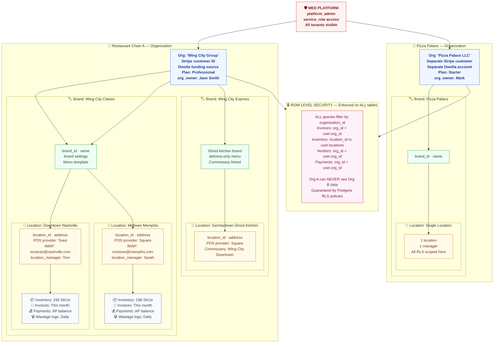
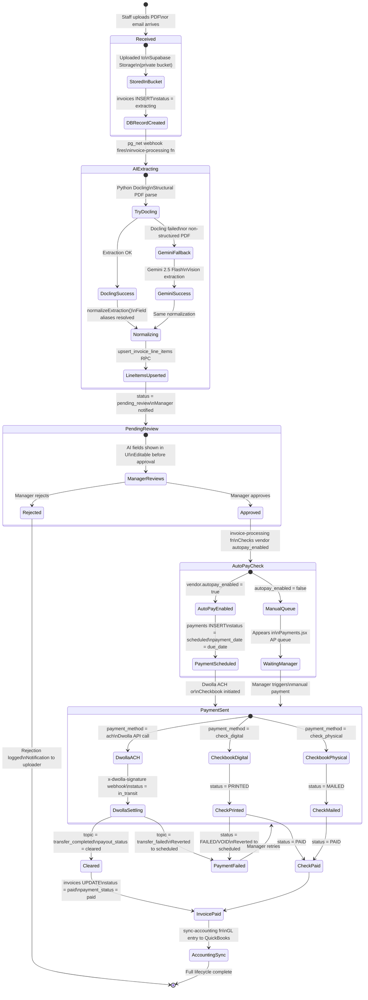
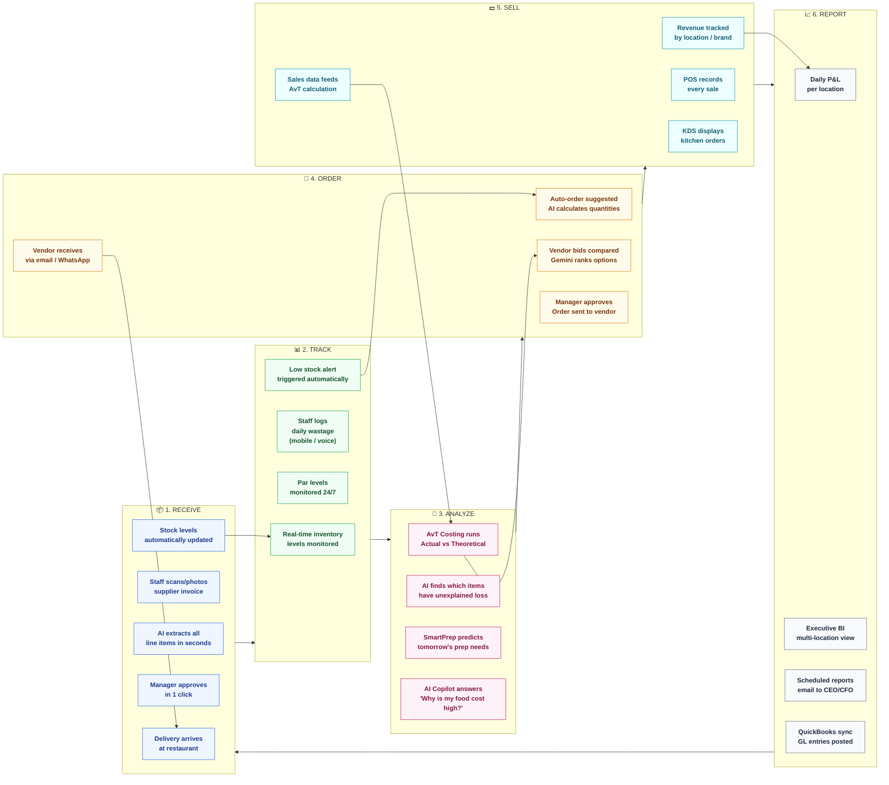
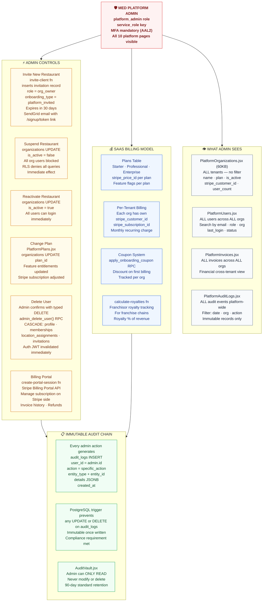
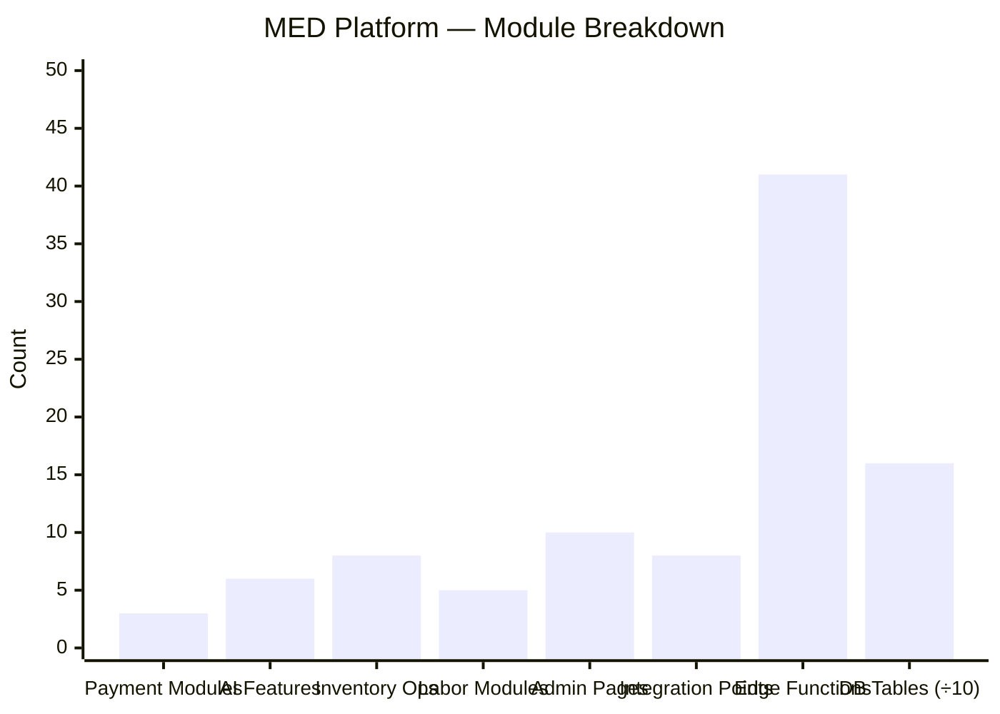

# MED Restaurant SaaS — CEO Architecture & Business Flow Diagrams
## Pictorial · Executive Presentation Edition

> **Platform**: MED Restaurant SaaS · Multi-Tenant · 41 Microservices · 57 Modules  
> **Audience**: CEO · Board · Enterprise Architect  
> **Date**: 2026-06-29  
> **Standard**: Diagrams sourced from actual production codebase  

---

## Diagram Index

| # | Diagram | Purpose |
|---|---|---|
| A | [Business Value Loop](#a-business-value-loop) | How the platform creates value end-to-end |
| B | [System Architecture — C4 Context](#b-system-architecture--c4-context) | What the platform is made of |
| C | [Data Flow Architecture](#c-data-flow-architecture) | Where data enters, travels and lives |
| D | [Multi-Tenant Data Model](#d-multi-tenant-hierarchy--data-model) | How organizations, brands and locations relate |
| E | [User Journey Map](#e-user-journey-map--all-roles) | What every type of user can do |
| F | [Invoice Lifecycle](#f-invoice-lifecycle--money-flow) | From paper invoice to paid — end to end |
| G | [Payment Gateway Routing](#g-payment-gateway-decision-tree) | Stripe · Dwolla · Checkbook selection logic |
| H | [AI Brain of the Platform](#h-ai-brain--gemini-integration-map) | Every Gemini touchpoint |
| I | [Operational Value Cycle](#i-operational-value-cycle) | Inventory → Waste → Order → Sales → Reports |
| J | [Security & Compliance Architecture](#j-security--compliance-architecture) | Auth · MFA · RLS · Audit |
| K | [Integration Ecosystem](#k-integration-ecosystem-map) | Every external service connected |
| L | [Platform Admin Governance](#l-platform-admin-governance-model) | How the platform manages all tenants |

---

## A. Business Value Loop

> The core business value the platform delivers — what the CEO should see first.

```mermaid
flowchart LR
    classDef money fill:#f0fdf4,stroke:#16a34a,color:#14532d,
    classDef ops fill:#eff6ff,stroke:#2563eb,color:#1e3a8a,font-weight:bold
    classDef ai fill:#fdf2f8,stroke:#be185d,color:#831843,font-weight:bold
    classDef save fill:#fffbeb,stroke:#d97706,color:#78350f,font-weight:bold
    classDef report fill:#f8fafc,stroke:#64748b,color:#1e293b,font-weight:bold

    subgraph IN["📥 MONEY IN — What restaurants spend"]
        I1["🧾 Supplier Invoices\nEmail · Scan · Upload\nAuto-extracted by AI"]
        I2["🏪 POS Sales Data\nToast · Square · Clover\nReal-time webhooks"]
        I3["👷 Labor Costs\nShifts · Time clock\nPayroll export"]
    end

    subgraph BRAIN["🤖 AI INTELLIGENCE CENTER"]
        B1["Gemini 2.5 Flash\nExtracts every line item\nfrom invoices in seconds"]
        B2["SmartPrep AI\nPredicts exactly what\nto prep every morning"]
        B3["AvT Analysis\nFinds food cost leaks\nvariance by ingredient"]
        B4["AI Copilot Chat\n'Show my top 5 wasted\nitems this week'"]
    end

    subgraph CONTROL["⚙ OPERATIONS CONTROL"]
        C1["📦 Inventory\nReal-time stock levels\nPar-level monitoring"]
        C2["🔄 Auto-Ordering\nAI-suggested quantities\nVendor bid comparison"]
        C3["🍳 Kitchen Prep\nSmartPrep lists\nKDS displays"]
        C4["🗑 Waste Logging\nMobile + voice entry\nCost impact tracking"]
    end

    subgraph OUT["💰 MONEY OUT — Controlled payments"]
        O1["💳 Stripe\nCard payments\nSubscription billing"]
        O2["🏦 Dwolla ACH\nBank transfers\n1-3 day settlement"]
        O3["🏛 Checkbook\nDigital + physical checks\nVendor flexibility"]
    end

    subgraph VALUE["📊 VALUE DELIVERED"]
        V1["📉 Food Cost Reduction\n2-5% via waste tracking\nand AvT analysis"]
        V2["⏱ AP Time Saved\n80% less manual data entry\nAI auto-extracts invoices"]
        V3["💡 Insights on Demand\nCEO dashboard\nMulti-location P&L"]
        V4["🔒 Compliance\nAudit trail · RLS · MFA\nSOC2-ready architecture"]
    end

    I1 --> B1 --> C1
    I2 --> B3 --> C2
    I3 --> B2 --> C3
    I1 --> B4 --> C4

    C1 --> O1
    C2 --> O2
    C1 --> O3
    C4 --> V1

    B3 --> V1
    B1 --> V2
    B4 --> V3
    C1 --> V4

    class I1,I2,I3 ops
    class B1,B2,B3,B4 ai
    class C1,C2,C3,C4 ops
    class O1,O2,O3 money
    class V1,V2,V3,V4 save
```

---

## B. System Architecture — C4 Context

> The complete technology stack — what it's built on, and how the layers connect.

```mermaid
flowchart TB
    classDef user fill:#eff6ff,stroke:#2563eb,color:#1e3a8a,font-weight:bold
    classDef frontend fill:#ecfeff,stroke:#0891b2,color:#155e75
    classDef backend fill:#fffbeb,stroke:#d97706,color:#78350f
    classDef database fill:#f0fdf4,stroke:#16a34a,color:#14532d
    classDef ai fill:#fdf2f8,stroke:#be185d,color:#831843
    classDef payments fill:#f0fdf4,stroke:#16a34a,color:#14532d
    classDef integrations fill:#f8fafc,stroke:#64748b,color:#334155
    classDef infra fill:#fef2f2,stroke:#dc2626,color:#7f1d1d

    subgraph ACTORS["👥 WHO USES IT"]
        A1["🏦 Org Owner\nFull control · Billing\nMulti-brand management"]
        A2["👔 Branch Manager\nMulti-location · Orders\nApprovals · Reports"]
        A3["📍 Location Manager\nDaily ops · Invoices\nInventory · Payments"]
        A4["👷 Ground Staff\nUpload invoices\nLog waste · Count stock"]
        A5["🛡 Platform Admin\nAll tenants · Governance\nSystem health"]
    end

    subgraph FRONTEND["⚛ REACT FRONTEND — Deployed on Vercel"]
        F1["React 18 + Vite\nCode-split lazy routing\n57 page modules"]
        F2["Capacitor Mobile\nIOS + Android\nNative shell wrapper"]
        F3["57 Feature Modules\nInvoices · Payments · Inventory\nRecipes · Labor · AI · KDS\nSmartPrep · Commissary · CRM\nVendor Bidding · Executive BI"]
    end

    subgraph SUPABASE["🗄 SUPABASE — Backend-as-a-Service"]
        SB1["Auth Service\nJWT · PKCE · MFA TOTP\nGoogle OAuth · Azure AD SSO\nDevice trust 30 days"]
        SB2["PostgreSQL Database\nRow Level Security (RLS)\n160+ tables · 237 migrations\nMulti-tenant by org_id"]
        SB3["Storage\ninvoices bucket (private)\nReceiptes · Avatars\nAuto-ingested PDFs"]
        SB4["Realtime\nWebSocket channels\nLive inventory updates\nNotification push"]
        SB5["pg_net\nDatabase → HTTP webhooks\nTriggers edge functions\nOn INSERT/UPDATE events"]
    end

    subgraph EDGE["⚙ 41 DENO EDGE FUNCTIONS"]
        E1["Invoice AI\ninvoice-processing\nDocling → Gemini 2.5 Flash"]
        E2["Email Import\nprocess-email-invoices\nIMAP polling · PDF upload"]
        E3["Payments\nprocess-payout (Dwolla)\nprocess-checkbook-payout\ncreate-checkout-session"]
        E4["Webhooks\nstripe-webhook\npayout-webhook\ncheckbook-webhook\npos-webhook"]
        E5["AI Features\nai-insights-chat\nsmartprep-cron\nforecast-labor\nevaluate-vendor-bids\nvoice-copilot-parser"]
        E6["Scheduling\nschedule-reports\ndashboard-report-scheduler\nbilling-worker\npg-backup"]
        E7["Onboarding\ninvite-user · invite-client\nvendor-onboarding\nprocess-onboarding"]
    end

    subgraph EXTERNAL["🌐 EXTERNAL SERVICES"]
        subgraph PAYMENTS_EXT["💳 PAYMENT GATEWAYS"]
            P1["Stripe\nSaaS billing\nCard payments"]
            P2["Dwolla\nACH transfers\nBank-to-bank"]
            P3["Checkbook.io\nDigital + physical\nchecks"]
        end
        subgraph AI_EXT["🤖 AI SERVICES"]
            AI1["Google Gemini 2.5 Flash\nInvoice extraction\nAI chat copilot"]
            AI2["Python Docling\nPDF structural parsing\nPrimary extractor"]
        end
        subgraph POS_EXT["🖥 POS INTEGRATIONS"]
            POS1["Toast · Square\nClover · 7shifts\nWebhook receivers"]
        end
        subgraph COMMS["📧 COMMUNICATIONS"]
            CM1["SendGrid / Resend\nTransactional email\nInvites · Alerts"]
            CM2["IMAP Mailboxes\nimap-simple npm\nAuto invoice ingestion"]
        end
        subgraph ACCOUNTING["📚 ACCOUNTING"]
            AC1["QuickBooks / Xero\nGL sync (sync-accounting fn)\nJournal entries"]
        end
    end

    ACTORS --> FRONTEND
    FRONTEND --> SUPABASE
    SUPABASE --> EDGE
    EDGE --> SUPABASE
    EDGE --> EXTERNAL
    EXTERNAL --> EDGE

    class A1,A2,A3,A4,A5 user
    class F1,F2,F3 frontend
    class SB1,SB2,SB3,SB4,SB5 database
    class E1,E2,E3,E4,E5,E6,E7 backend
    class P1,P2,P3 payments
    class AI1,AI2 ai
    class POS1,CM1,CM2,AC1 integrations
```



---

## C. Data Flow Architecture

> How data enters the platform, where it travels, and where it ultimately lives.

```mermaid
flowchart TD
    classDef source fill:#eff6ff,stroke:#2563eb,color:#1e3a8a,font-weight:bold
    classDef ingest fill:#fdf2f8,stroke:#be185d,color:#831843
    classDef process fill:#fffbeb,stroke:#d97706,color:#78350f
    classDef store fill:#f0fdf4,stroke:#16a34a,color:#14532d
    classDef serve fill:#ecfeff,stroke:#0891b2,color:#155e75
    classDef output fill:#f8fafc,stroke:#475569,color:#1e293b,font-weight:bold

    subgraph SOURCES["📥 DATA SOURCES"]
        S1["📄 PDF Invoice\n(Uploaded or Emailed)"]
        S2["🖥 POS Terminal\n(Toast / Square / Clover)"]
        S3["👷 Staff Mobile\n(Waste Log / Count)"]
        S4["🌡 IoT Sensors\n(Temperature / Equipment)"]
        S5["💬 Voice Command\n('I wasted 5lb chicken')"]
        S6["💳 Stripe Webhook\n(Subscription events)"]
        S7["🏦 Dwolla Webhook\n(ACH status events)"]
        S8["🏛 Checkbook Webhook\n(Check status events)"]
    end

    subgraph INGESTION["🔄 INGESTION LAYER — Edge Functions"]
        I1["invoice-processing fn\nDocling Python + Gemini 2.5 Flash\nStructured JSON extraction"]
        I2["process-email-invoices fn\nIMAP poll → Storage upload\n→ invoice-processing trigger"]
        I3["pos-webhook fn\n?provider= routing\nToast · Square · Clover · 7shifts"]
        I4["iot-ingest fn\nSensor reading normalization"]
        I5["voice-copilot-parser fn\nTranscript → intent mapping\nGemini NLU (roadmap)"]
        I6["stripe-webhook fn\ncheckout.session.completed\n→ plan upgrade"]
        I7["payout-webhook fn\ntransfer_completed\n→ invoice paid"]
        I8["checkbook-webhook fn\nPAID / PRINTED / FAILED\n→ invoice status"]
    end

    subgraph PROCESSING["⚙ PROCESSING LAYER"]
        P1["normalizeExtraction()\nField aliasing · Date parsing\nMoney parsing · Null safety\nUS Foods vendor-specific repair"]
        P2["calculate-depletion fn\nTheoretical usage from POS\nVs actual from inventory movements"]
        P3["smartprep-cron fn\nGemini prompt per org\nPredicted prep quantities"]
        P4["sync-accounting fn\nMap invoices → GL entries\nQuickBooks API (roadmap active)"]
        P5["evaluate-vendor-bids fn\nGemini multi-criteria scoring\nPrice 40% · Quality 25%\nDelivery 20% · Terms 15%"]
        P6["ai-insights-chat fn\nGemini 2.5 Flash RAG\nScoped to org/brand/location\nLast 8 messages history"]
    end

    subgraph STORAGE["🗄 DATA STORAGE — Supabase PostgreSQL + Storage"]
        subgraph FINANCIAL["💰 Financial Data"]
            DB1["invoices\nAll header + line items\nstatus workflow · AP tracking"]
            DB2["payments\nMethod · payout_status\ndwolla_transfer_url\ncheckbook_check_id"]
            DB3["vendors\nautopay_enabled\ndefault_payment_method\nDwolla funding source"]
        end
        subgraph OPERATIONAL["⚙ Operational Data"]
            DB4["inventory\ncurrent_quantity · par_level\nunit_cost · last_counted"]
            DB5["inventory_movements\nAppend-only log\ncount · waste · purchase\nreference traceability"]
            DB6["wastage_logs\nreason · value · product\nlogged_by · location"]
            DB7["auto_orders\nstatus workflow\napproval chain\ndelivery tracking"]
        end
        subgraph ANALYTICS["📊 Analytics Data"]
            DB8["pos_orders · pos_order_items\nSales history · provider\nAll POS transactions"]
            DB9["ai_insights\ninsight_type · severity\nmetadata JSONB\nsmartprep lists"]
            DB10["mv_daily_sales_summary\nMaterialized view\nAggregated by date+location"]
        end
        subgraph SECURITY["🔒 Audit Data"]
            DB11["audit_logs\nImmutable append-only\nAll admin actions"]
            DB12["event_logs\nAll POS webhook payloads\nDebug + replay"]
            DB13["debug_logs\nInvoice extraction steps\nError traces"]
        end
        ST1["invoices/ bucket (private)\nOriginal PDFs stored\nService role download only"]
    end

    subgraph SERVING["📡 SERVING LAYER — React Frontend"]
        R1["React Query\nSWR caching · Polling\nOptimistic updates"]
        R2["Dashboard.jsx\nKPI cards · Revenue charts\nLow stock alerts"]
        R3["Invoices.jsx\nAI extraction review\nAP workflow management"]
        R4["Payments.jsx\nVendor payment dispatch\nReconciliation view"]
        R5["AvTCosting.jsx\nVariance analysis\nColor-coded thresholds"]
        R6["AiInsights.jsx\nGemini chat copilot\nSuggested actions"]
        R7["ExecutiveBI.jsx\nMulti-location revenue\nOrg-level P&L"]
    end

    subgraph OUTPUTS["📤 BUSINESS OUTPUTS"]
        O1["📧 Email Notifications\nLow stock · Invoice approved\nPayment cleared"]
        O2["📊 Scheduled Reports\nDaily · Weekly · Monthly\nCSV + PDF export"]
        O3["💰 Vendor Payments\nStripe · Dwolla · Checkbook"]
        O4["📚 Accounting Sync\nQuickBooks GL entries\nJournal mapping"]
        O5["📱 Push Notifications\nMobile via Capacitor\nReal-time Supabase channels"]
    end

    S1 --> I1 --> P1 --> DB1
    S1 --> I2 --> I1
    S2 --> I3 --> DB8
    S3 --> DB6
    S4 --> I4 --> DB9
    S5 --> I5 --> DB6
    S6 --> I6 --> DB2
    S7 --> I7 --> DB2
    S8 --> I8 --> DB2

    DB8 --> P2 --> DB5
    DB1 --> P3
    DB8 --> P3 --> DB9
    DB1 --> P4 --> O4
    DB3 --> P5 --> DB7
    DB1 --> P6 --> R6

    DB1 --> R3
    DB2 --> R4
    DB4 --> R2
    DB5 --> R5
    DB8 --> R2
    DB9 --> R6
    DB9 --> R7

    R2 --> O2
    DB4 --> O1
    DB2 --> O3
    DB1 --> O5

    ST1 --> I1

    class S1,S2,S3,S4,S5,S6,S7,S8 source
    class I1,I2,I3,I4,I5,I6,I7,I8 ingest
    class P1,P2,P3,P4,P5,P6 process
    class DB1,DB2,DB3,DB4,DB5,DB6,DB7,DB8,DB9,DB10,DB11,DB12,DB13,ST1 store
    class R1,R2,R3,R4,R5,R6,R7 serve
    class O1,O2,O3,O4,O5 output
```



---

## D. Multi-Tenant Hierarchy & Data Model

> How restaurants, brands and locations are organized inside the platform.



---

## E. User Journey Map — All Roles

> What each type of user does from login to value delivery.


---

## F. Invoice Lifecycle & Money Flow

> The complete journey of a supplier invoice — from receipt to payment cleared.



---

## G. Payment Gateway Decision Tree

> How the system decides which payment processor to use for each payment.

 

---

## I. Operational Value Cycle

> The continuous loop that drives daily restaurant operations on the platform.



---

## J. Security & Compliance Architecture

> How the platform is secured at every layer — from login to database row.

```mermaid
flowchart TB
    classDef auth fill:#faf5ff,stroke:#7c3aed,color:#4c1d95,font-weight:bold
    classDef rls fill:#f0fdf4,stroke:#16a34a,color:#14532d,font-weight:bold
    classDef audit fill:#fffbeb,stroke:#d97706,color:#78350f,font-weight:bold
    classDef network fill:#eff6ff,stroke:#2563eb,color:#1e3a8a
    classDef encrypt fill:#fef2f2,stroke:#dc2626,color:#7f1d1d

    subgraph LAYER1["🔐 LAYER 1 — Identity & Authentication"]
        L1A["Supabase Auth\nJWT tokens — short lived\nPKCE OAuth2 flow"]
        L1B["Password Policy\nMin 6 chars · Hashed bcrypt\nReset via verified email only"]
        L1C["SSO Options\nGoogle OAuth2\nMicrosoft Azure AD\nSAML (Enterprise)"]
        L1D["MFA — MANDATORY\nfor platform_admin\nfor org_owner\nfor branch_manager\nTOTP authenticator app\nAAL1 → AAL2 upgrade"]
        L1E["Device Trust\n30-day trusted device\nlocalStorage token\nuser_id + expiry validation"]
    end

    subgraph LAYER2["🛡 LAYER 2 — Authorization & RBAC"]
        L2A["5 Role Hierarchy\nplatform_admin (rank 4)\norg_owner (rank 3)\nbranch_manager (rank 2)\nlocation_manager (rank 1)\nground_staff (rank 0)"]
        L2B["ProtectedModule.jsx\nEach page checks\nuser.role vs required\nBefore rendering any content"]
        L2C["JWT Claims\nrole embedded in JWT\nChecked client-side\nAND server-side in RLS"]
    end

    subgraph LAYER3["🗄 LAYER 3 — Database Row Level Security"]
        L3A["RLS on ALL Tables\nEvery SELECT / INSERT / UPDATE / DELETE\nchecks organization_id\nagainst user's org_id from JWT"]
        L3B["Location Scoping\nlocation_manager only sees\ntheir assigned location rows\nNot other locations in same org"]
        L3C["service_role Exception\nOnly platform_admin uses\nservice_role key\nBypasses ALL RLS\nAll other users use anon key"]
        L3D["Cross-Tenant Isolation\nOrg A can NEVER\nread Org B data\nGuaranteed by Postgres policy"]
    end

    subgraph LAYER4["📡 LAYER 4 — API & Network Security"]
        L4A["Edge Functions — HTTPS only\nAll endpoints TLS encrypted\nCORS headers enforced\nAuthorization header required"]
        L4B["Webhook Signature Verification\nDwolla: x-dwolla-signature\nHMAC-SHA256 of raw body\nCheckbook: Authorization header\nHMAC-SHA256 verification"]
        L4C["Storage Access\nInvoice bucket: private\nNo public URLs\nService role download in fn\nSignature required for client"]
    end

    subgraph LAYER5["📋 LAYER 5 — Audit & Compliance"]
        L5A["audit_logs table\nImmutable — no UPDATE/DELETE\nPostgreSQL trigger enforcement\nEvery admin action logged\n90-day+ retention"]
        L5B["AuditVault.jsx (20KB)\nPlatform admin view\nAll tenants searchable\nFilter by action/date/user"]
        L5C["debug_logs table\nInvoice processing steps\nFull extraction trace\nError messages stored"]
        L5D["event_logs table\nAll POS webhook payloads\nRaw + parsed data\nReplay capability"]
    end

    subgraph LAYER6["🔒 LAYER 6 — Data Encryption"]
        L6A["In Transit: TLS 1.3\nAll HTTPS connections\nSupabase managed certs"]
        L6B["At Rest: AES-256\nSupabase managed encryption\nStorage + Database"]
        L6C["Vendor Banking Data\nRouting + account numbers\nEncrypted at application layer\nNever logged in plaintext"]
    end

    LAYER1 --> LAYER2 --> LAYER3 --> LAYER4 --> LAYER5 --> LAYER6

    class L1A,L1B,L1C,L1D,L1E auth
    class L2A,L2B,L2C auth
    class L3A,L3B,L3C,L3D rls
    class L4A,L4B,L4C network
    class L5A,L5B,L5C,L5D audit
    class L6A,L6B,L6C encrypt
```



---

## K. Integration Ecosystem Map

> Every external service the platform connects to and why.

```mermaid
flowchart LR
    classDef core fill:#ecfeff,stroke:#0891b2,color:#0c4a6e,font-weight:bold
    classDef payment fill:#f0fdf4,stroke:#15803d,color:#14532d,font-weight:bold
    classDef ai fill:#fdf2f8,stroke:#be185d,color:#831843,font-weight:bold
    classDef pos fill:#eff6ff,stroke:#1d4ed8,color:#1e3a8a,font-weight:bold
    classDef comms fill:#fffbeb,stroke:#d97706,color:#78350f,font-weight:bold
    classDef accounting fill:#f8fafc,stroke:#475569,color:#1e293b,font-weight:bold
    classDef infra fill:#fef2f2,stroke:#dc2626,color:#7f1d1d,font-weight:bold

    CORE["⚛ MED Platform\nReact + Supabase\n41 Edge Functions"]

    subgraph PAY["💳 Payment Gateways"]
        P1["Stripe\nSaaS subscription billing\nCard payments\nWebhook: checkout.session.completed\nStripe Customer ID stored on org"]
        P2["Dwolla\nVendor ACH bank transfers\nHMAC webhook security\nCustomer verified/suspended events\nFunding source per vendor"]
        P3["Checkbook.io\nDigital check delivery\nPhysical USPS check mailing\nHMAC webhook security\nPAID/VOID/PRINTED/MAILED events"]
    end

    subgraph AISVCS["🤖 AI & ML"]
        A1["Google Gemini 2.5 Flash\nInvoice extraction (primary fallback)\nAI Insights Copilot (all managers)\nRAG over live org data\nTemperature 0.2 for factual accuracy"]
        A2["Gemini Pro\nSmartPrep nightly cron\nVendor bid evaluation\nLabor forecasting\nOrder quantity suggestions"]
        A3["Python Docling Backend\nPDF structural parsing\nPrimary invoice extraction\nPYTHON_BACKEND_URL env var\nFalls back to Gemini if fails"]
    end

    subgraph POSSVCS["🖥 POS Systems"]
        PO1["Toast POS\norder.completed webhook\nLine items normalized\n?provider=toast routing"]
        PO2["Square POS\nSame structure as Toast\norder.completed webhook\n?provider=square routing"]
        PO3["Clover POS\nRaw payload stored\nevent_logs table\nFull parsing: roadmap"]
        PO4["7shifts\nLabor shift data\nSchedule integration\nRaw payload for now"]
    end

    subgraph COMMSSVCS["📧 Communications"]
        C1["SendGrid / Resend\nTransactional email\nVendor invitations\nOrder confirmations\nInvoice rejection notices"]
        C2["IMAP / Email Mailboxes\nimap-simple npm\nsimpleParser mailparser\nAuto-ingest supplier invoices\nFrom: org-configured mailbox"]
        C3["WhatsApp Business API\nVendor order delivery\nPO notifications\nVendor prefers WhatsApp"]
        C4["EmailJS (fallback)\nFrontend email fallback\nIf SendGrid not configured"]
    end

    subgraph ACCOUNTINGSVCS["📚 Accounting & ERP"]
        AC1["QuickBooks Online\nsync-accounting fn\nJournal entry mapping\nOAuth2 integration\nActive in production roadmap"]
        AC2["Xero (planned)\nAlternative to QuickBooks\nSame GL sync pattern"]
    end

    subgraph INFRASVCS["☁ Infrastructure"]
        IN1["Vercel\nReact SPA hosting\nEdge CDN deployment\nvercel.json config"]
        IN2["Supabase Cloud\nPostgreSQL + Auth + Storage\nEdge Functions runtime\nRealtime WebSockets"]
        IN3["Google Cloud\nGemini API hosting\nBilling via API key"]
        IN4["Capacitor\nMobile app wrapper\niOS + Android native\nSame React codebase"]
    end

    CORE <-->|"Subscription billing\nWebhook events"| P1
    CORE <-->|"ACH transfers\nVendor payments"| P2
    CORE <-->|"Check creation\nStatus webhooks"| P3
    CORE <-->|"Invoice extraction\nChat copilot"| A1
    CORE <-->|"Prep lists\nBid scoring"| A2
    CORE <-->|"PDF parsing\nFallback to Gemini"| A3
    CORE <-->|"Sales webhooks"| PO1
    CORE <-->|"Sales webhooks"| PO2
    CORE <-->|"Raw webhooks"| PO3
    CORE <-->|"Labor data"| PO4
    CORE <-->|"Email delivery"| C1
    CORE <-->|"Invoice ingestion"| C2
    CORE <-->|"Order delivery"| C3
    CORE <-->|"GL sync"| AC1
    CORE -->|"Hosted on"| IN1
    CORE -->|"Powered by"| IN2
    CORE -->|"AI via"| IN3
    CORE -->|"Mobile via"| IN4

    class CORE core
    class P1,P2,P3 payment
    class A1,A2,A3 ai
    class PO1,PO2,PO3,PO4 pos
    class C1,C2,C3,C4 comms
    class AC1,AC2 accounting
    class IN1,IN2,IN3,IN4 infra
```



---

## L. Platform Admin Governance Model

> How MED (as a company) manages all restaurant clients on the platform.



---

## At a Glance — Platform Numbers



---

*Source: Production codebase — `code/src/App.jsx` · `code/supabase/functions/` (41 fns) · `code/src/pages.config.js`*  
*CEO Architecture Diagrams · MED Restaurant SaaS · 2026-06-29*
