# MED Restaurant SaaS — Complete Process Flow Diagrams
## Based on Actual Codebase · Senior Workflow Designer Architect Edition

> **Source**: `/code/src/App.jsx` · `/code/supabase/functions/` · `/code/src/modules/`  
> **40 Deno Edge Functions · 57 Page Components · Multi-Tenant · Supabase + React · Azure Target Architecture**  
> **Audience**: CEO · Enterprise Architect  · Date: 2026-06-29

---

## Table of Contents

| # | Workflow | Key Components |
|---|---|---|
| 1 | [Platform Overview (C4 Layer)](#1-platform-architecture-overview) | React · Supabase · Azure · Gemini |
| 2 | [Invoice AI Extraction](#2-invoice-ai-extraction-workflow) | `invoice-processing` fn · Docling · Gemini 2.5 Flash |
| 3 | [Email Invoice Import](#3-email-invoice-import) | `process-email-invoices` fn · IMAP · `integrations` table |
| 4 | [Authentication Onboarding MFA](#4-authentication--onboarding--mfa-gate) | `App.jsx` routing · MFAChallenge · BusinessVerification |
| 5 | [Stripe Checkout & SaaS Billing](#5-stripe-saas-billing) | `create-checkout-session` · `stripe-webhook` fn |
| 6 | [Vendor Payment — Dwolla ACH](#6-vendor-payment--dwolla-ach) | `process-payout` · `payout-webhook` fn |
| 7 | [Vendor Payment — Checkbook](#7-vendor-payment--checkbook) | `process-checkbook-payout` · `checkbook-webhook` fn |
| 8 | [AutoPay Trigger](#8-autopay-trigger) | `invoice-processing` fn · `vendors.autopay_enabled` |
| 9 | [Stock Count & Inventory](#9-stock-count--inventory-management) | `Inventory.jsx` · `inventory_movements` |
| 10 | [Wastage & AvT Costing](#10-wastage-logging--avt-costing) | `AvTCosting.jsx` · `wastage_logs` · POS data |
| 11 | [Auto Ordering & POs](#11-auto-ordering--purchase-orders) | `AutoOrdering.jsx` · `calculate-depletion` fn · Gemini |
| 12 | [POS Webhook Integration](#12-pos--sales-integration) | `pos-webhook` fn · `event_logs` · `pos_orders` |
| 13 | [SmartPrep Nightly Cron](#13-smartprep-ai-nightly-prep-list) | `smartprep-cron` fn · `gemini-pro` · `ai_insights` |
| 14 | [Platform Admin Control Plane](#14-platform-admin-control-plane) | `PlatformOrganizations.jsx` · service_role · RBAC |
| 15 | [Azure Native Runtime Flow](#15-azure-native-runtime-flow-target-state) | Static Web Apps · API Management · Blob · Event Grid · Queue |

---

## 1. Platform Architecture Overview

```mermaid
flowchart TD
    classDef user fill:#eff6ff,stroke:#2563eb,color:#1e3a8a,font-weight:bold
    classDef react fill:#ecfeff,stroke:#0891b2,color:#155e75
    classDef fn fill:#fffbeb,stroke:#d97706,color:#78350f
    classDef db fill:#f0fdf4,stroke:#16a34a,color:#14532d
    classDef ai fill:#fdf2f8,stroke:#be185d,color:#831843
    classDef ext fill:#f8fafc,stroke:#64748b,color:#334155
    classDef auth fill:#faf5ff,stroke:#7c3aed,color:#4c1d95

    subgraph USERS["👥 Users — 5 RBAC Roles"]
        U1["👷 ground_staff\nUpload invoices · Log waste"]
        U2["👔 location_manager\nApprove invoices · Reports"]
        U3["🏢 branch_manager\nMulti-location · Large POs"]
        U4["🏦 org_owner\nFull org · Billing · QB"]
        U5["🛡 platform_admin\nAll tenants · service_role"]
    end

    subgraph FRONTEND["⚛ React SPA — 57 Pages · Vite · Capacitor Mobile"]
        SPA["React 18 SPA\npages.config.js lazy routing\nProtectedModule RBAC gates"]
        LAYOUT["Layout.jsx (29KB)\nSidebar · Header · Context selectors\nBrand/Location switcher"]
    end

    subgraph AUTH["🔐 Supabase Auth"]
        SUPABASE_AUTH["supabase.auth\nJWT · PKCE\nMFA TOTP (AAL1→AAL2)\nDevice trust 30 days"]
        AUTHCTX["AuthContext.jsx\nuser · profile · role\norg_id · mfaLevel"]
    end

    subgraph EDGE["⚙ 40 Deno Edge Functions — Supabase Functions"]
        INV_FN["invoice-processing\nDocling → Gemini 2.5 Flash\nUpsert invoices"]
        EMAIL_FN["process-email-invoices\nIMAP · imap-simple\nMailparser · Storage upload"]
        PAY_FN["process-payout (Dwolla ACH)\npayout-webhook\ncheckbook-webhook"]
        STRIPE_FN["create-checkout-session\ncreate-payment-intent\nstripe-webhook"]
        SMART_FN["smartprep-cron\ngemini-pro\nai_insights INSERT"]
        POS_FN["pos-webhook\nevent_logs · pos_orders\npos_order_items"]
        OTHER_FN["calculate-depletion\nsync-accounting\nschedule-reports\ndashboard-report-scheduler\nvoice-copilot-parser\nforecast-labor\nevaluate-vendor-bids\ninvite-user · invite-client\nvendor-onboarding\nbilling-worker\ncalculate-royalties"]
    end

    subgraph DB["🗄 Supabase PostgreSQL — RLS on ALL tables"]
        TABLES["Key Tables:\ninvoices · payments · vendors\norganizations · profiles\npos_orders · pos_order_items\ninventory · inventory_movements\nwastage_logs · auto_orders\nai_insights · event_logs\nintegrations · audit_logs\ndebug_logs · notifications"]
        STORAGE["Supabase Storage\ninvoices bucket (private)\nreceipts · avatars\nauto-ingested/ path"]
    end

    subgraph EXTERNAL["🌐 External Services"]
        STRIPE_EXT["💳 Stripe\nSubscription billing\ncheckout.sessions\nwebhook: checkout.session.completed"]
        DWOLLA["🏦 Dwolla\nACH transfers\ntopic: transfer_completed\nx-dwolla-signature HMAC"]
        CB["🏛 Checkbook.io\nDigital + Physical checks\nstatus: PAID/PRINTED/MAILED\nHMAC SHA256 verify"]
        GEMINI["🤖 Gemini 2.5 Flash\nInvoice extraction\ngemini-pro SmartPrep"]
        DOCLING["🐍 Python Docling\nPDF structural parse\nfetch /extract-invoice"]
        IMAP["📧 IMAP Mailbox\nimap-simple npm\nsimpleParser mailparser"]
        POS["🖥 POS Systems\nToast · Square · Clover · 7shifts\n?provider= query param"]
        QB["📚 QuickBooks\nsync-accounting fn\nOAuth2 API"]
    end

    USERS --> FRONTEND
    FRONTEND --> AUTH
    AUTH --> FRONTEND
    FRONTEND --> EDGE
    EDGE --> DB
    EDGE --> EXTERNAL
    DB --> EDGE

    class U1,U2,U3,U4,U5 user
    class SPA,LAYOUT react
    class SUPABASE_AUTH,AUTHCTX auth
    class INV_FN,EMAIL_FN,PAY_FN,STRIPE_FN,SMART_FN,POS_FN,OTHER_FN fn
    class TABLES,STORAGE db
    class STRIPE_EXT,DWOLLA,CB,GEMINI,DOCLING,IMAP,POS,QB ext
```

---

## 2. Invoice AI Extraction Workflow

> **Code**: `supabase/functions/invoice-processing/index.ts` (655 lines)  
> **Trigger**: `invoices.status = 'extracting'` (pg_net webhook from DB INSERT)  
> **AI**: Docling Python backend → Gemini 2.5 Flash fallback  

```mermaid
flowchart TD
    classDef user fill:#eff6ff,stroke:#2563eb,color:#1e3a8a,font-weight:bold
    classDef react fill:#ecfeff,stroke:#0891b2,color:#155e75
    classDef fn fill:#fffbeb,stroke:#d97706,color:#78350f
    classDef db fill:#f0fdf4,stroke:#16a34a,color:#14532d
    classDef ai fill:#fdf2f8,stroke:#be185d,color:#831843
    classDef ext fill:#f8fafc,stroke:#64748b,color:#334155
    classDef warn fill:#fffbeb,stroke:#f59e0b,color:#78350f
    classDef stop fill:#dcfce7,stroke:#15803d,color:#14532d

    START(["▶ START"])

    subgraph UPLOAD["📤 MANUAL UPLOAD — Invoices.jsx"]
        U1["1. User opens Invoices.jsx\nClicks Upload Invoice"]
        U2["2. File picker opens\nAccepts: PDF / JPEG / PNG / TIFF"]
        U3["3. Client-side validation\nFile type + size check"]
        U4["4. Request Supabase Storage\nsigned upload URL\nBucket: invoices (private)"]
        U5["5. Browser uploads file directly\nto Supabase Storage\nPath: auto-ingested/{uuid}_{filename}"]
        U6["6. invoices INSERT via\nsave_invoice_workflow RPC\nstatus = 'extracting'\nfile_url = storage path"]
    end

    subgraph TRIGGER["🔔 DATABASE TRIGGER — pg_net"]
        T1["7. pg_net webhook fires\non invoices INSERT\nWHERE status = 'extracting'"]
        T2["8. POST invoice-processing\nedge function\nPayload: type, table, record, old_record"]
    end

    subgraph CLAIM["🔒 IDEMPOTENCY CLAIM"]
        C1["9. Check shouldProcessExtraction\ntable = 'invoices'\nrecord.status = 'extracting'\ntype = INSERT OR status changed"]
        C2["10. Claim the invoice\nUPDATE invoices\nSET extraction_started_at = now()\nWHERE id = record.id\nAND status = 'extracting'\nAND extraction_started_at IS NULL"]
        CLAIMED{"11. Claim\nsuccessful?"}
        C3["Already claimed by another\nworker — skip gracefully\ndebug_logs INSERT: claim_skipped"]
    end

    subgraph DOWNLOAD["📥 FILE DOWNLOAD"]
        D1["12. Resolve file path\nStrip 'invoices/' prefix\nfrom file_url"]
        D2["13. Download from Supabase Storage\nsupabaseClient.storage\n.from('invoices').download(filePath)\nUsing service role — no SAS needed"]
    end

    subgraph EXTRACT["🤖 AI EXTRACTION — Dual Path"]
        E1["14. Try Docling first\nPython backend URL\nfrom PYTHON_BACKEND_URL env var"]
        E2["15. POST /extract-invoice\nFormData: file blob\nExpect: JSON with raw_text\nand line_items[]"]
        DOCLING_OK{"16. Docling\nsucceeded?"}
        E3["17. repairExtractionFromRawText()\nUS Foods vendor-specific parser\nRegex pattern matching on rawText\nFixes vendor_name mis-reads\nUpgrades line item count if better"]
        E4["18. FALLBACK: extractWithGeminiVision()\nGemini 2.5 Flash model\nBase64 encode file blob\ngenerateContent() with\ndetailed extraction prompt\nExpects strict JSON — no markdown"]
        E5["19. repairExtractionFromRawText()\nsame repair logic applied\nextraction_method = 'gemini_vision_fallback'"]
    end

    subgraph NORMALIZE["🔧 NORMALIZE — normalizeExtraction()"]
        N1["20. normalizeExtraction(data)\n  parseMoney(): strip $ , signs\n  normalizeDate(): ISO 8601\n  firstValue(): null-safe field resolution\n  Aliases: subtotal/invoice_subtotal/merchandise_total\n  paid_status_detection confidence check"]
        N2["21. mapLineItemsForRpc()\nMap each line item:\n  item_name · quantity · unit_price\n  total_price · vendor_item_code · vendor_unit\nFilter: must have item_name OR vendor_item_code"]
    end

    subgraph UPDATE_DB["💾 DATABASE UPDATE"]
        DB1["22. UPDATE invoices\nstatus = 'pending_review'\nap_status = 'processing'\nvendor_name · invoice_number\ninvoice_date · due_date · total_amount\nline_items JSONB\nextraction_method\nraw_text · validation_results"]
        DB2["23. upsert_invoice_line_items RPC\nInsert each line item\nif lineItemsForRpc.length > 0\nLinks to invoice via invoice_id"]
        DB3["24. debug_logs INSERT\nPoint: 'success'\ninvoice_id · line_items_count"]
    end

    subgraph REVIEW["👔 MANAGER REVIEW — Invoices.jsx"]
        R1["25. React Query polls invoice status\nDetects pending_review\nRenders extracted fields"]
        R2["26. Manager reviews\nAI-extracted data\nCan edit any field"]
        APPROVE{"27. Approve\nor Reject?"}
        R3["28a. UPDATE invoices\nstatus = 'approved'\nap_status changes"]
        R4["28b. UPDATE invoices\nstatus = 'rejected'\nrejection_reason stored"]
    end

    subgraph AUTOPAY_CHECK["💰 AUTOPAY CHECK — invoice-processing fn"]
        AP1["29. On status UPDATE to 'approved'\nedge function re-fires\nChecks vendors.autopay_enabled"]
        AP2["30. Query vendors table\nMatch vendor_id OR vendor_name\nWHERE organization_id matches"]
        AP3{"31. vendor\nautopay_enabled?"}
        AP4["32. payments INSERT\nstatus = 'scheduled'\npayment_method = vendor.default_payment_method\npayment_date = invoice.due_date"]
        AP5["33. invoices UPDATE\npayment_status = 'scheduled'"]
        AP6["Invoice in AP queue\nfor manual payment"]
    end

    subgraph FAIL_PATH["⚠ FAILURE HANDLING"]
        F1["Error caught in try/catch\nUPDATE invoices\nstatus = 'extract_failed'\nap_status = 'action_required'\nvalidation_results: error message\ndebug_logs INSERT"]
    end

    END_OK(["⏹ END\nInvoice pending_review"])
    END_AUTO(["⏹ END\nAutomatic payment scheduled"])
    END_AP(["⏹ END\nIn AP queue for manual pay"])
    END_REJ(["⏹ END\nRejected"])
    END_FAIL(["⏹ END\nextract_failed"])

    START --> U1 --> U2 --> U3 --> U4 --> U5 --> U6 --> T1 --> T2
    T2 --> C1 --> C2 --> CLAIMED
    CLAIMED -->|"No"| C3
    CLAIMED -->|"Yes"| D1 --> D2
    D2 --> E1 --> E2 --> DOCLING_OK
    DOCLING_OK -->|"Yes"| E3 --> N1
    DOCLING_OK -->|"No"| E4 --> E5 --> N1
    N1 --> N2 --> DB1 --> DB2 --> DB3 --> R1 --> R2 --> APPROVE
    APPROVE -->|"Approve"| R3 --> AP1 --> AP2 --> AP3
    AP3 -->|"Yes"| AP4 --> AP5 --> END_AUTO
    AP3 -->|"No"| AP6 --> END_AP
    APPROVE -->|"Reject"| R4 --> END_REJ
    DB2 -->|"exception"| F1 --> END_FAIL
    DB1 --> END_OK

    class START,END_OK,END_AUTO,END_AP,END_REJ,END_FAIL stop
    class U1,U2,U3 user
    class U4,U5,U6,R1,R2 react
    class T1,T2,C1,C2,D1,D2,E1,E2,E3,E4,E5,N1,N2 fn
    class DB1,DB2,DB3,AP4,AP5 db
    class R3,R4,AP1,AP2 fn
    class CLAIMED,DOCLING_OK,APPROVE,AP3 ai
    class F1 warn
    class C3 warn
```

---

## 3. Email Invoice Import

> **Code**: `supabase/functions/process-email-invoices/index.ts` (129 lines)  
> **Trigger**: Manual call or pg_cron schedule  
> **Config**: `integrations` table WHERE `provider = 'email_imap'` AND `is_active = true`  

```mermaid
flowchart TD
    classDef user fill:#eff6ff,stroke:#2563eb,color:#1e3a8a,font-weight:bold
    classDef fn fill:#fffbeb,stroke:#d97706,color:#78350f
    classDef db fill:#f0fdf4,stroke:#16a34a,color:#14532d
    classDef ext fill:#f8fafc,stroke:#64748b,color:#334155
    classDef warn fill:#fffbeb,stroke:#f59e0b,color:#78350f
    classDef stop fill:#dcfce7,stroke:#15803d,color:#14532d

    START(["▶ START\npg_cron or manual trigger"])

    S1["1. process-email-invoices edge fn invoked"]
    S2["2. Query integrations table\nWHERE provider = 'email_imap'\nAND is_active = true\nFetch: host · port · username · password\nFrom: config.metadata JSONB"]
    NO_CFG{"3. Any active\nIMAP configs?"}
    S3["Return: No active IMAP configurations"]
    S4["4. For each config:\nConnect via imap-simple npm\nimap.connect(host, port=993, tls=true)"]
    S5["5. connection.openBox('INBOX')\nSearch criteria: ['UNSEEN']\nmarkSeen: true (prevent re-processing)"]
    S6["6. Fetch unseen messages\nBodies: HEADER, TEXT, raw\nStruct: true for attachment detection"]
    S7["7. For each message:\nsimpleParser(message)\nExtract: from · subject · attachments[]"]
    S8["8. Filter attachments\ncontentType === 'application/pdf'\nSkip if no PDF attachments"]
    S9["9. Upload PDF to Supabase Storage\nBucket: invoices\nPath: auto-ingested/{uuid}_{sanitized_filename}\nRemove special chars from filename"]
    UP_OK{"10. Upload\nsucceeded?"}
    S10["11. save_invoice_workflow RPC call\nPayload:\n  organization_id: from config.metadata\n  status: 'extracting'\n  file_url: storage path\n  vendor_name: parsed.from.text\n  raw_text: parsed.text\n  invoice_number: EMAIL-{uid}-{timestamp}\n  total_amount: 0\n  source: 'email'"]
    S11["12. status='extracting' triggers\npg_net webhook →\ninvoice-processing edge fn\n(same path as manual upload)"]
    S12["13. connection.end()\nResults array collects:\n  {email, subject, status: 'processed'}"]
    S13["Return results[] summary\nProcessed count · Failed count"]

    END_OK(["⏹ END\nInvoices queued for AI extraction"])
    END_NO(["⏹ END\nNo configs — no action"])

    START --> S1 --> S2 --> NO_CFG
    NO_CFG -->|"None"| S3 --> END_NO
    NO_CFG -->|"Found"| S4 --> S5 --> S6 --> S7 --> S8 --> S9 --> UP_OK
    UP_OK -->|"Yes"| S10 --> S11 --> S12
    UP_OK -->|"No"| S12
    S12 --> S13 --> END_OK

    class START,END_OK,END_NO stop
    class S1,S2,S4,S5,S6,S7,S8,S9,S10,S11,S12,S13 fn
    class NO_CFG,UP_OK fn
    class S3 warn
```

---

## 4. Authentication, Onboarding & MFA Gate

> **Code**: `src/App.jsx` (959 lines) — full routing state machine  
> **Key states from App.jsx**: `needsBusinessVerification` → `needsPaymentVerification` → `needsOnboarding` → `needsAssignment`  
> **MFA roles**: `platform_admin`, `org_owner`, `branch_manager` — MANDATORY AAL2  

```mermaid
flowchart TD
    classDef user fill:#eff6ff,stroke:#2563eb,color:#1e3a8a,font-weight:bold
    classDef react fill:#ecfeff,stroke:#0891b2,color:#155e75
    classDef fn fill:#fffbeb,stroke:#d97706,color:#78350f
    classDef db fill:#f0fdf4,stroke:#16a34a,color:#14532d
    classDef auth fill:#faf5ff,stroke:#7c3aed,color:#4c1d95
    classDef warn fill:#fffbeb,stroke:#f59e0b,color:#78350f
    classDef stop fill:#dcfce7,stroke:#15803d,color:#14532d

    START(["▶ START\nUser visits app"])

    subgraph ENTRY["🌐 ENTRY POINT"]
        E1{"User session\nexists?"}
        E2["Anonymous user\n→ LandingPage.jsx\n→ /login → LoginPage"]
        E3["Existing user\nsupabase.auth.signInWithPassword()"]
        E4["New user\nsupabase.auth.signUp()\nraw_user_meta_data: full_name · role · invite_token"]
    end

    subgraph AUTH_STATE["🔐 AUTH STATE MACHINE — App.jsx lines 700–914"]
        AS1{"isMfaReady?\n(~1.5s after login)"}
        AS2["Show 'Setting up account...' spinner\nWait for MFA status to resolve\nPrevents premature redirect flash\n(App.jsx line 778-786)"]
        AS3{"needsMFAChallenge?\nAAL1 session\nbut enrolled?"}
        AS4["→ MFAChallenge component\nUser enters TOTP code\nsupabase.auth.mfa.challenge()"]
        DEVICE{"Device trusted?\nlocalStorage:\nrestops_mfa_trust\n30-day expiry"}
        AS5{"needsMFASetup?\nrole requires MFA\nbut not enrolled?"}
        AS6["→ MFASetupPage.jsx\nGenerate TOTP\nQR code display\nEnroll via\nsupabase.auth.mfa.enroll()"]
        SETUP{"needsBusinessVerification?\nbusiness_verification_status\n!= 'verified'"}
        PAYV{"needsPaymentVerification?\nbusiness verified\nAND NOT payment_verified"}
        ONBOARD{"needsOnboarding?\nbusiness + payment verified\nno org_id yet"}
        ASSIGN{"needsAssignment?\nnot org_owner\nno org_id yet"}
    end

    subgraph BIZ_VER["📋 BUSINESS VERIFICATION — BusinessVerification.jsx"]
        BV1["User submits business details\nEIN · Business name\nVerification documents\nbusiness_verification_status"]
        BV2["profiles UPDATE\nbusiness_verification_status = 'verified'"]
    end

    subgraph PAYMENT_VER["💳 PAYMENT VERIFICATION — PaymentVerification.jsx"]
        PV1["create-checkout-session edge fn called\nChecks:\n  business_verification_status = 'verified'\n  profile.payment_verified = false\n  organization_id must exist"]
        PV2["Stripe Checkout Session created\nmode = 'subscription'\nclient_reference_id = org_id\nmetadata: plan_id · user_id\nReturns: session.url"]
        PV3["Browser redirects to\nStripe Checkout\nhttps://checkout.stripe.com/..."]
        PV4["Customer enters card\nStripe processes payment"]
        PV5["stripe-webhook fn receives\ncheckout.session.completed event\nExtracts: client_reference_id (org_id)\nmetadata.plan_id"]
        PV6["organizations UPDATE\nplan_id = plan_id\nstripe_customer_id = session.customer\nstripe_subscription_id = session.subscription\nlog_audit_event RPC called"]
    end

    subgraph ONBOARDING["🏗 ONBOARDING — OnboardingPage.jsx"]
        OB1["Multi-step wizard\nStep 1: Organization name\nStep 2: Brand details\nStep 3: First location\nStep 4: Review + Confirm"]
        OB2["process-onboarding edge fn\nHandles: demo_requests table events\nOrg creation triggered from here"]
        OB3["profiles UPDATE org_id\nOrg + Brand + Location created\nOrg membership assigned"]
    end

    subgraph PENDING["⏳ PENDING ASSIGNMENT"]
        PA1["PendingAssignmentPage\nnon-owner without org\nWaits for manager to assign"]
    end

    subgraph FULL_APP["✅ FULL APP — All 57 Pages"]
        FA1["Dashboard.jsx (main page)\ncanonicalRoutes rendered\nlegacyRoutes rendered\nProtectedModule gates each page\nLayout.jsx with sidebar"]
        FA2["Role-based sidebar items\nground_staff: Invoices · Inventory\nmanager: + Payments · AutoOrdering\nowner: + OrgManagement · Billing\nplatform_admin: Platform pages"]
    end

    subgraph SIGNUP_INVITE["✉ INVITED USER SIGNUP — /signup/:token"]
        SU1["get_invite_details RPC\nclean token (strip trailing chars)\nlog_invitation_opened RPC"]
        SU2{"Token valid\nand not expired?"}
        SU3["Show error:\nInvalid or expired invitation"]
        SU4["SignupPage.jsx pre-fills\nemail (read-only from invite)\nShows invited role"]
        SU5["supabase.auth.signUp()\nraw_user_meta_data:\n  full_name · role (mapped)\n  invite_token"]
        SU6["Role mapping applied:\nowner → org_owner\nadmin → platform_admin\nmanager → branch_manager"]
        SU7["If session returned → navigate /\nIf no session (confirm required)\n→ navigate /login after 3 seconds"]
    end

    END_FULL(["⏹ END\nFull App (AAL2)"])
    END_WAIT(["⏹ END\nPending Manager Assignment"])
    END_INV(["⏹ END\nInvalid Invite"])

    START --> E1
    E1 -->|"No session"| E2
    E2 --> E3
    E2 --> E4
    E2 --> SU1 --> SU2
    SU2 -->|"Invalid"| SU3 --> END_INV
    SU2 -->|"Valid"| SU4 --> SU5 --> SU6 --> SU7
    E3 --> AS1
    E4 --> AS1
    AS1 -->|"Not ready (new user)"| AS2 --> AS1
    AS1 -->|"Ready"| AS3
    AS3 -->|"Yes"| DEVICE
    DEVICE -->|"Trusted (localStorage)"| AS5
    DEVICE -->|"Not trusted"| AS4 --> AS5
    AS3 -->|"No"| AS5
    AS5 -->|"Yes"| AS6 --> SETUP
    AS5 -->|"No"| SETUP
    SETUP -->|"Yes"| BV1 --> BV2 --> PAYV
    SETUP -->|"No"| PAYV
    PAYV -->|"Yes"| PV1 --> PV2 --> PV3 --> PV4 --> PV5 --> PV6 --> ONBOARD
    PAYV -->|"No"| ONBOARD
    ONBOARD -->|"Yes"| OB1 --> OB2 --> OB3 --> FA1
    ONBOARD -->|"No"| ASSIGN
    ASSIGN -->|"Yes (non-owner)"| PA1 --> END_WAIT
    ASSIGN -->|"No — has org"| FA1 --> FA2 --> END_FULL

    class START,END_FULL,END_WAIT,END_INV stop
    class E1,E2,E3,E4 user
    class AS1,AS2,AS3,AS4,AS5,AS6,DEVICE,SETUP,PAYV,ONBOARD,ASSIGN auth
    class BV1,BV2,SU4,SU5,OB1,FA1,FA2 react
    class PV1,PV2,OB2,SU1,SU6 fn
    class PV5,PV6,OB3 fn
    class PV3,PV4 db
    class PA1 warn
    class SU2 auth
    class SU3,SU7 warn
```

---

## 5. Stripe SaaS Billing

> **Code**: `create-checkout-session/index.ts` (165 lines) · `stripe-webhook/index.ts` (66 lines)  
> **Gate**: Business verification → payment verification order strictly enforced in code  

```mermaid
flowchart TD
    classDef user fill:#eff6ff,stroke:#2563eb,color:#1e3a8a,font-weight:bold
    classDef fn fill:#fffbeb,stroke:#d97706,color:#78350f
    classDef db fill:#f0fdf4,stroke:#16a34a,color:#14532d
    classDef ext fill:#f8fafc,stroke:#64748b,color:#334155
    classDef warn fill:#fffbeb,stroke:#f59e0b,color:#78350f
    classDef stop fill:#dcfce7,stroke:#15803d,color:#14532d
    classDef auth fill:#faf5ff,stroke:#7c3aed,color:#4c1d95

    START(["▶ START\nUser opens Billing.jsx\nOR new user in payment gate"])

    subgraph SESSION["🔧 create-checkout-session edge fn"]
        CS1["1. Validate JWT\nsupabase.auth.getUser()\nThrow if not authenticated"]
        CS2["2. Fetch profile\nprofiles SELECT:\n  id · email · organization_id\n  payment_verified\n  business_verification_status"]
        CS3{"3. Pre-checkout\ngates (in code order):"}
        CS4["GATE 1: business_verification_status\nmust equal 'verified'\nThrow: 'Business verification required'"]
        CS5["GATE 2: payment_verified\nmust be true\nThrow: 'Payment method verification required'"]
        CS6["GATE 3: organization_id\nmust exist\nThrow: 'Organization setup required'"]
        CS7["4. Fetch plan from plans table\nplan.id · name · price_monthly\nstripe_price_id"]
        CS8{"5. price_monthly == 0?\n(free plan)"}
        CS9["FREE: organizations UPDATE\nplan_id = plan.id\nReturn success immediately\nNo Stripe needed"]
        CS10["6. Optional coupon check\napply_onboarding_coupon RPC\nif couponCode provided"]
        CS11["7. Get/create Stripe customer\nIf no org.stripe_customer_id:\n  stripe.customers.create()\n  organizations UPDATE\n  stripe_customer_id = customer.id"]
        CS12["8. stripe.checkout.sessions.create()\nmode: 'subscription'\ncustomer: customerId\nline_items: [{price: resolvedPriceId, qty:1}]\nmetadata:\n  organization_id · user_id\n  plan_id · coupon_code\n  payment_method_type\nallow_promotion_codes: true"]
        CS13["9. Return session.url\nFrontend redirects browser\nto Stripe Checkout page"]
    end

    subgraph STRIPE_CHECKOUT["💳 Stripe Hosted Checkout"]
        SC1["Customer on checkout.stripe.com\nEnters credit card / ACH\nStripe handles all PCI compliance"]
        SC2["Payment processed by Stripe\nSubscription created"]
    end

    subgraph WEBHOOK["📡 stripe-webhook edge fn (66 lines)"]
        WH1["10. Stripe fires POST webhook\ncheckout.session.completed event\nHeader: stripe-signature"]
        WH2["11. NOTE: Production signature\nverification marked TODO in code\n(stripe.webhooks.constructEvent)\nCurrently parses event directly"]
        WH3["12. Extract from session:\n  client_reference_id = org_id\n  metadata.plan_id"]
        WH4{"13. orgId AND\nplanId present?"}
        WH5["14. organizations UPDATE\nplan_id = planId\nstripe_customer_id = session.customer\nstripe_subscription_id = session.subscription"]
        WH6["15. log_audit_event RPC\naction: 'subscription_upgraded'\nentity_type: 'organization'\nentity_id: orgId\ndetails: {plan_id, session_id}"]
        WH7["Return: {received: true}\nHTTP 200"]
    end

    END_FREE(["⏹ END\nFree plan activated"])
    END_PAID(["⏹ END\nSubscription active · Org upgraded"])
    END_ERR(["⏹ END\nError — HTTP 400"])

    START --> CS1 --> CS2 --> CS3
    CS3 --> CS4
    CS4 -->|"fails"| END_ERR
    CS4 -->|"passes"| CS5
    CS5 -->|"fails"| END_ERR
    CS5 -->|"passes"| CS6
    CS6 -->|"fails"| END_ERR
    CS6 -->|"passes"| CS7 --> CS8
    CS8 -->|"Yes"| CS9 --> END_FREE
    CS8 -->|"No"| CS10 --> CS11 --> CS12 --> CS13
    CS13 --> SC1 --> SC2 --> WH1 --> WH2 --> WH3 --> WH4
    WH4 -->|"Yes"| WH5 --> WH6 --> WH7 --> END_PAID
    WH4 -->|"No"| WH7 --> END_PAID

    class START,END_FREE,END_PAID,END_ERR stop
    class CS1,CS2,CS3,CS4,CS5,CS6,CS7,CS8,CS9,CS10,CS11,CS12,CS13 fn
    class SC1,SC2 ext
    class WH1,WH2,WH3,WH4,WH5,WH6,WH7 fn
    class CS3,CS8,WH4 auth
```

---

## 6. Vendor Payment — Dwolla ACH

> **Code**: `payout-webhook/index.ts` (84 lines)  
> **Signature**: `x-dwolla-signature` header — HMAC SHA256 of raw body  
> **Topics**: `transfer_completed` · `transfer_failed` · `transfer_cancelled` · `customer_verified`  

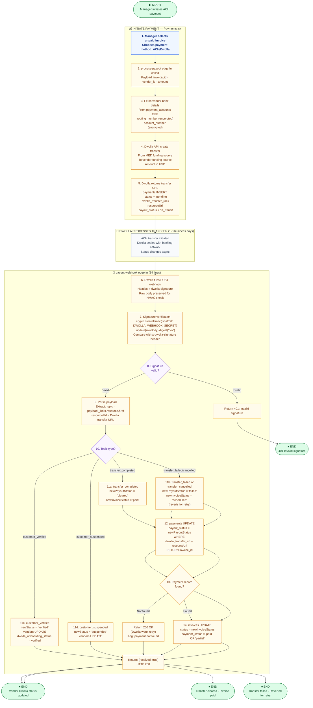

---

## 7. Vendor Payment — Checkbook

> **Code**: `checkbook-webhook/index.ts` (85 lines)  
> **Signature**: `Authorization` header — HMAC SHA256 of raw body  
> **Statuses**: `PAID` · `VOID` · `FAILED` · `EXPIRED` · `PRINTED` · `MAILED`  

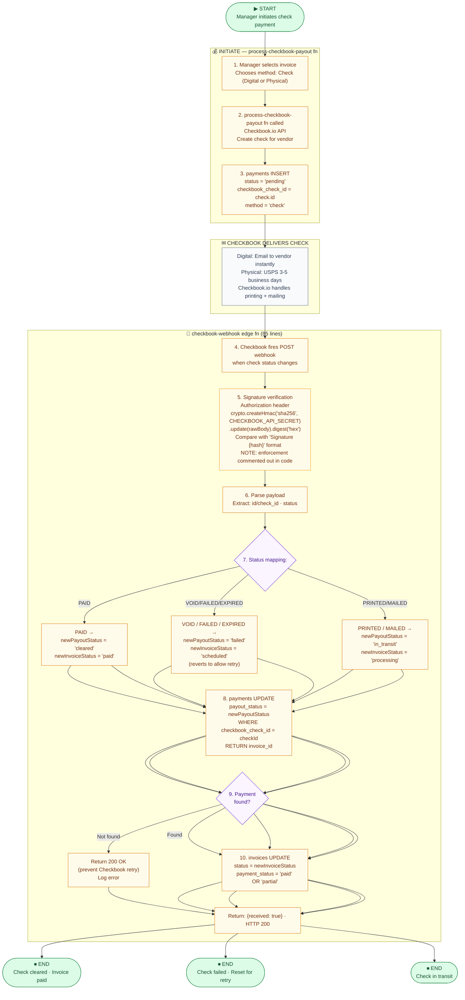

---

## 8. AutoPay Trigger

> **Code**: `invoice-processing/index.ts` lines 596–635  
> **Trigger**: `invoices.status` UPDATE to `'approved'`  
> **Table**: `vendors.autopay_enabled` · `vendors.default_payment_method`  

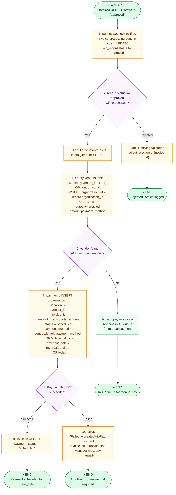

---

## 9. Stock Count & Inventory Management

> **Code**: `src/modules/inventory/pages/Inventory.jsx`  
> **Tables**: `inventory` · `inventory_movements` (type=count_adjustment) · `inventory_count_sheets`  

```mermaid
flowchart TD
    classDef user fill:#eff6ff,stroke:#2563eb,color:#1e3a8a,font-weight:bold
    classDef react fill:#ecfeff,stroke:#0891b2,color:#155e75
    classDef db fill:#f0fdf4,stroke:#16a34a,color:#14532d
    classDef stop fill:#dcfce7,stroke:#15803d,color:#14532d
    classDef auth fill:#faf5ff,stroke:#7c3aed,color:#4c1d95
    classDef warn fill:#fffbeb,stroke:#f59e0b,color:#78350f

    START(["▶ START\nStock Count"])

    subgraph PREPARE["📋 PREPARE COUNT SHEET"]
        P1["1. Staff/Manager opens Inventory.jsx\nNavigates to Count Sheet tab"]
        P2["2. System fetches inventory table\nWHERE location_id = user location\ncurrent_quantity · unit · par_level\nSorted by category then name"]
        P3["3. Optional: select scope\nFull count · Category · Spot check"]
    end

    subgraph COUNT["🔢 PHYSICAL COUNT"]
        C1["4. Staff physically counts each product\nEnters actual_quantity in form\nSystem shows:\n  system_qty vs actual_qty\n  variance delta\n  variance % (>10% flagged red)"]
        C2["5. Notes field for large variances\nDamaged/method notes optional"]
        C3["6. Repeat for all products in scope"]
    end

    subgraph SUBMIT["✅ SUBMIT"]
        S1["7. Manager reviews summary\nTotal items · Items with variance\nTotal cost impact estimate"]
        S2["8. Click Submit Count"]
        VAL{"9. Validation:\nall qty >= 0\nno nulls?"}
        S3["Show errors — block submit"]
    end

    subgraph UPDATE["💾 DATABASE UPDATES — per changed item"]
        U1["10. For each item WHERE actual != system:"]
        U2["11. inventory UPDATE\ncurrent_quantity = actual_quantity\ncurrent_value = actual × unit_cost\nlast_counted_date = now()\nlast_counted_by = user_id"]
        U3["12. inventory_movements INSERT\nmovement_type = 'count_adjustment'\nquantity_change = actual - system\nreason = 'stock_count'\nreference_id = count_sheet_id\nAppend-only — no delete"]
        PAR{"13. current_quantity\n< par_level?"}
        U4["14. notifications INSERT\ntype = inventory.low_stock\nFor: location_manager\nActionable: Create Order"]
        U5["No alert needed"]
    end

    subgraph FINALIZE["📁 FINALIZE SESSION"]
        F1["15. inventory_count_sheets INSERT\ncount_date · location_id\ncount_type · total_items_counted\nitems_with_variance\ntotal_variance_value\nconfirmed_by · duration_minutes\nstatus = 'completed'"]
        F2["16. Export CSV option\nProduct · System · Actual\nVariance · Variance % · Value impact"]
        F3["17. audit_logs INSERT\naction = inventory.count_completed"]
    end

    END_OK(["⏹ END\nCount complete · Inventory updated"])

    START --> P1 --> P2 --> P3 --> C1 --> C2 --> C3 --> S1 --> S2 --> VAL
    VAL -->|"Invalid"| S3 --> S2
    VAL -->|"Valid"| U1 --> U2 --> U3 --> PAR
    PAR -->|"Below par"| U4 --> F1
    PAR -->|"OK"| U5 --> F1
    F1 --> F2 --> F3 --> END_OK

    class START,END_OK stop
    class P1,C1,C2,S1,S2 user
    class P2,P3 react
    class VAL,PAR auth
    class U1,U2,U3,U4 db
    class U5 db
    class F1,F2,F3 db
    class S3 warn
```

---

## 10. Wastage Logging & AvT Costing

> **Code**: `src/modules/inventory/pages/Inventory.jsx` · `AvTCosting.jsx`  
> **Tables**: `wastage_logs` · `inventory_movements` (type=waste) · `pos_orders` · `pos_order_items`  

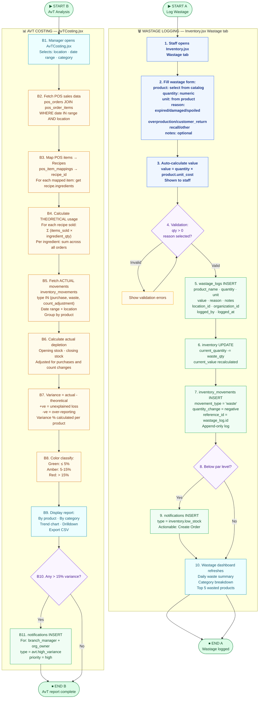

---

## 11. Auto Ordering & Purchase Orders

> **Code**: `src/modules/orders/pages/AutoOrdering.jsx` · `calculate-depletion/index.ts` · `evaluate-vendor-bids/index.ts`  
> **AI**: Gemini Pro for quantity suggestions via `calculate-depletion` fn  
> **Delivery**: `invite-user` style email OR WhatsApp via vendor config  

```mermaid
flowchart TD
    classDef user fill:#eff6ff,stroke:#2563eb,color:#1e3a8a,font-weight:bold
    classDef react fill:#ecfeff,stroke:#0891b2,color:#155e75
    classDef fn fill:#fffbeb,stroke:#d97706,color:#78350f
    classDef db fill:#f0fdf4,stroke:#16a34a,color:#14532d
    classDef ai fill:#fdf2f8,stroke:#be185d,color:#831843
    classDef ext fill:#f8fafc,stroke:#64748b,color:#334155
    classDef stop fill:#dcfce7,stroke:#15803d,color:#14532d
    classDef auth fill:#faf5ff,stroke:#7c3aed,color:#4c1d95
    classDef warn fill:#fffbeb,stroke:#f59e0b,color:#78350f

    START(["▶ START\nAuto Ordering"])

    subgraph TRIGGERS["🔔 ORDER TRIGGERS"]
        T1["Trigger A: Par level breach\nnotification alert fires\nManager clicks Create Order"]
        T2["Trigger B: Manual\nOpens AutoOrdering.jsx directly"]
        T3["Trigger C: pg_cron scan\nInventory scan edge fn\nIdentifies below-par products"]
    end

    subgraph REVIEW["📋 PRODUCT REVIEW — AutoOrdering.jsx"]
        R1["1. AutoOrdering.jsx loads\nQuery: inventory\nWHERE current_quantity < par_level\nAND location_id = user.location_id\nSorted by shortfall DESC"]
        R2["2. Group products by vendor\nFor efficient single-vendor ordering"]
    end

    subgraph DEPLETION["📊 AI DEPLETION — calculate-depletion fn"]
        D1["3. POST calculate-depletion fn\nPayload: organization_id · sales_data\nFetches inventory + recipe configs\nCalculates theoretical depletion\nBased on 30-day sales history"]
        D2["4. Gemini API called\ngemini-pro:generateContent\nContext: historical usage · day patterns\nReturns: suggested quantities + reasoning"]
        D3["5. Draft order pre-filled in UI\nCurrent qty · Par level · AI suggestion\nEditable by manager"]
    end

    subgraph EDIT["✏ MANAGER REVIEW"]
        E1["6. Manager edits quantities\nSets delivery date\nConfirms vendor selection"]
        E2["7. auto_orders INSERT\nstatus = 'draft'\nitems JSONB array\ntotal_amount · vendor_id\nlocation_id · requested_by"]
    end

    subgraph APPROVAL["✅ APPROVAL GATE"]
        AP1["8. Check approval limits\nRBAC approval_limits table\nbranch_manager: $5K default\norg_owner: unlimited"]
        LIMIT{"9. Exceeds\napproval limit?"}
        AP2["10. Notify org_owner\nnotifications INSERT\nActionable: Approve/Reject"]
        APPROVED{"11. org_owner\napproves?"}
        AP3["auto_orders UPDATE\nstatus = 'rejected'"]
        AP4["auto_orders UPDATE\nstatus = 'approved'\napproved_by · approved_at"]
    end

    subgraph SEND["📤 SEND TO VENDOR"]
        S1["12. Check vendor.sent_via\nemail | whatsapp | both"]
        CHANNEL{"13. Channel?"}
        S2["14a. Email via SendGrid\nOrder PDF generated\nTo: vendor.email\nSubject: PO #{order_number}"]
        S3["14b. WhatsApp\nWhatsApp Business API\nStructured message with items list\nTo: vendor.whatsapp_number"]
        S4["15. auto_orders UPDATE\nstatus = 'sent'\nsent_via = channel\nsent_at = now()"]
        S5["16. notifications INSERT\nFor: requesting manager\ntype = auto_order.sent"]
    end

    subgraph BIDDING["🏷 OPTIONAL: VENDOR BIDDING"]
        VB1["VendorBidding.jsx\nCreate RFQ for multiple vendors"]
        VB2["Send RFQ via email/WhatsApp\nDeadline set for responses"]
        VB3["Vendors submit bids\nbid_responses table:\n  price · delivery_days · payment_terms"]
        VB4["evaluate-vendor-bids fn\nGemini scores bids:\n  Price 40% · Quality 25%\n  Delivery 20% · Terms 15%"]
        VB5["Best bid highlighted\nManager selects winner\nProceeds to order"]
    end

    END_SENT(["⏹ END\nOrder sent → Receiving starts"])
    END_REJ(["⏹ END\nOrder rejected"])

    START --> T1 --> R1
    START --> T2 --> R1
    START --> T3 --> R1
    R1 --> R2 --> D1 --> D2 --> D3
    D3 --> E1 --> E2 --> AP1 --> LIMIT
    LIMIT -->|"Within limit"| AP4
    LIMIT -->|"Exceeds"| AP2 --> APPROVED
    APPROVED -->|"Yes"| AP4
    APPROVED -->|"No"| AP3 --> END_REJ
    AP4 --> S1 --> CHANNEL
    CHANNEL -->|"email"| S2 --> S4
    CHANNEL -->|"whatsapp"| S3 --> S4
    CHANNEL -->|"both"| S2 --> S3 --> S4
    S4 --> S5 --> END_SENT
    START --> VB1 --> VB2 --> VB3 --> VB4 --> VB5 --> E1

    class START,END_SENT,END_REJ stop
    class T1,T2,T3,E1 user
    class R1,R2,D3 react
    class D1 fn
    class D2 ai
    class E2,AP1,AP2,S1,S2,S3,S4,S5 fn
    class AP4,AP3 db
    class LIMIT,CHANNEL,APPROVED auth
    class VB1,VB5 user
    class VB2,VB3,VB4 fn
```

---

## 12. POS & Sales Integration

> **Code**: `supabase/functions/pos-webhook/index.ts` (138 lines)  
> **Providers**: `?provider=toast|square|clover|7shifts`  
> **Tables**: `event_logs` · `pos_orders` · `pos_order_items`  

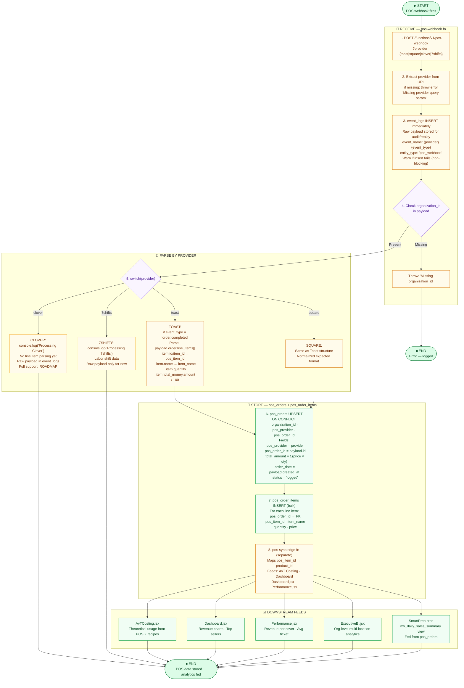

---

## 13. SmartPrep AI Nightly Prep List

> **Code**: `supabase/functions/smartprep-cron/index.ts` (71 lines)  
> **Model**: `gemini-pro:generateContent` via Gemini API  
> **Table**: `ai_insights` (insight_type = 'smart_prep_list')  

```mermaid
flowchart TD
    classDef fn fill:#fffbeb,stroke:#d97706,color:#78350f
    classDef db fill:#f0fdf4,stroke:#16a34a,color:#14532d
    classDef ai fill:#fdf2f8,stroke:#be185d,color:#831843
    classDef ext fill:#f8fafc,stroke:#64748b,color:#334155
    classDef stop fill:#dcfce7,stroke:#15803d,color:#14532d
    classDef user fill:#eff6ff,stroke:#2563eb,color:#1e3a8a,font-weight:bold

    START(["▶ START\npg_cron nightly trigger\nOR manual HTTP call"])

    subgraph CRON["⚙ smartprep-cron edge fn"]
        C1["1. smartprep-cron fn invoked\nDeno edge function\nGEMINI_API_KEY from env"]
        C2["2. Fetch ALL active organizations\nSELECT id · name FROM organizations\n(No WHERE clause — all orgs)"]
        C3["3. Calculate tomorrow's date\nnew Date() + 1 day\ntomorrowStr = YYYY-MM-DD format"]
        C4["4. For EACH organization:\nBuild Gemini prompt:\n  'You are an AI culinary assistant for {org.name}'\n  'Generate a JSON prep list for tomorrow ({date})'\n  'Based on historical sales data'\n  'Limit to 5 critical items'\n  'Return ONLY JSON like:\n    [{item_name, prep_amount, unit, priority}]'"]
        C5["5. POST Gemini API\nhttps://generativelanguage.googleapis.com\n/v1beta/models/gemini-pro:generateContent\n?key={GEMINI_API_KEY}\nBody: {contents: [{parts: [{text: prompt}]}]}"]
        C6["6. Parse response\ngeminiData.candidates[0].content.parts[0].text\nStrip markdown: replace ```json + ``` with empty\nJSON.parse(cleanJson)"]
        PARSE_OK{"7. rawText\nreturned?"}
        C7["8. ai_insights INSERT\norganization_id = org.id\ninsight_type = 'smart_prep_list'\ntitle = 'SmartPrep List for {date}'\ndescription = 'Auto-generated prep list'\nseverity = 'info'\nmetadata = {\n  date: tomorrowStr\n  items: prepItems[]\n}"]
        C8["Skip this org\nno rawText from Gemini"]
        C9["9. Loop: next organization\nProcess all orgs sequentially"]
    end

    subgraph MORNING["🌅 KITCHEN MORNING VIEW — SmartPrep.jsx"]
        K1["10. Kitchen staff opens SmartPrep.jsx\nNext morning"]
        K2["11. Query ai_insights\nWHERE insight_type = 'smart_prep_list'\nAND date = today (from metadata.date)\nAND organization_id = user.org_id"]
        K3["12. Display prep list\nSorted by priority: High → Medium → Low\nGrouped by timing: morning/afternoon/evening\nFor each item:\n  item_name · prep_amount · unit · priority"]
        K4["13. generate-prep-sheet fn\nOn-demand refresh option\nFor real-time inventory-adjusted list\nPDF export available"]
    end

    END_OK(["⏹ END\nPrep lists generated for all orgs"])
    END_MORNING(["⏹ END\nKitchen staff sees prep list"])

    START --> C1 --> C2 --> C3 --> C4 --> C5 --> C6 --> PARSE_OK
    PARSE_OK -->|"Yes"| C7 --> C9
    PARSE_OK -->|"No"| C8 --> C9
    C9 -->|"more orgs"| C4
    C9 -->|"all done"| END_OK
    END_OK --> K1 --> K2 --> K3 --> K4 --> END_MORNING

    class START,END_OK,END_MORNING stop
    class C1,C2,C3,C4,C5,C6,C7,C8,C9 fn
    class PARSE_OK fn
    class K1,K2,K3,K4 user
```

---

## 14. Platform Admin Control Plane

> **Code**: `src/modules/platform/pages/PlatformOrganizations.jsx` (60,882 bytes)  
> **Auth**: `service_role` key used — bypasses ALL PostgreSQL RLS  
> **Roles**: Only `platform_admin` can access these pages  

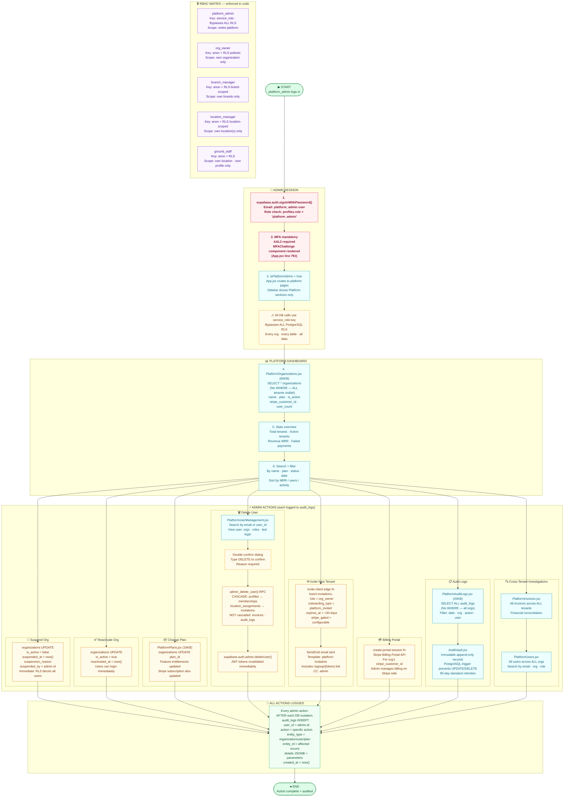

---

## 15. Azure Native Runtime Flow Target State

> Target-state runtime based on the Azure reference architecture. This is the operational migration view that maps current product workflows into Azure-native services.

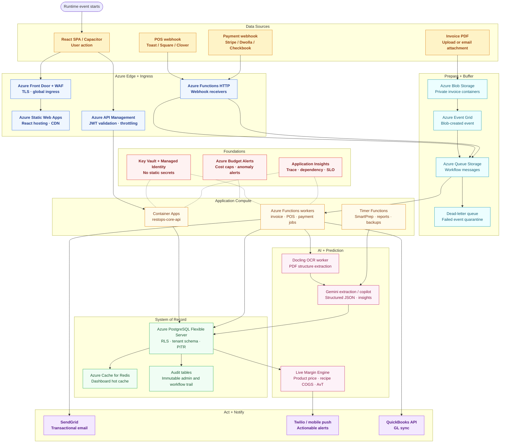

### Migration Sequencing

| Phase | Move | Validation Gate |
|---|---|---|
| 1 | Deploy React SPA to Azure Static Web Apps behind Front Door/WAF. | Login, route protection, module lazy loading and CDN headers verified. |
| 2 | Introduce API Management in front of existing APIs/functions. | JWT validation, throttling, tenant headers and CORS verified. |
| 3 | Move invoice file intake to Blob Storage + Event Grid + Queue. | Upload, extraction retry, DLQ and audit trail verified. |
| 4 | Move webhook receivers to Azure Functions. | Stripe, POS, Dwolla and Checkbook signature validation verified. |
| 5 | Move core API to Container Apps and database to Azure PostgreSQL Flexible Server. | RLS, migrations, dashboard latency and backup/PITR verified. |
| 6 | Replace realtime surfaces with Azure Web PubSub or SignalR where needed. | Product live margin events and notification fanout verified. |

---

## Appendix: All 40 Edge Functions — Reference Map

| Function | Trigger | Purpose |
|---|---|---|
| `ai-insights-chat` | HTTP (user) | Gemini-powered chat with org data context |
| `api-gateway` | HTTP | Central routing |
| `billing-worker` | Queue/scheduled | Billing automation |
| `calculate-depletion` | HTTP (AutoOrdering) | Theoretical usage calc + Gemini suggestions |
| `calculate-royalties` | Scheduled | Franchisor royalty calculations |
| `checkbook-webhook` | POST (Checkbook.io) | Check status: PAID/VOID/FAILED/PRINTED/MAILED |
| `create-api-key` | HTTP | DeveloperPortal API key generation |
| `create-checkout-session` | HTTP (frontend) | Stripe Checkout with business/payment gate |
| `create-payment-intent` | HTTP (frontend) | Stripe card payment intent |
| `create-portal-session` | HTTP (admin) | Stripe Billing Portal for platform admin |
| `create-stripe-invoice` | HTTP | Create Stripe invoice for B2B billing |
| `create-webhook-endpoint` | HTTP | Register webhook endpoints |
| `dashboard-report-scheduler` | Queue | Process scheduled report queue |
| `evaluate-vendor-bids` | HTTP (VendorBidding) | Gemini scores vendor bids multi-criteria |
| `forecast-labor` | HTTP (Labor) | Gemini labor scheduling forecast |
| `generate-prep-sheet` | HTTP (SmartPrep) | On-demand prep list regeneration |
| `invite-client` | HTTP (platform_admin) | Invite new tenant org |
| `invite-user` | HTTP (manager) | Invite team member via token |
| `invoice-processing` | pg_net webhook | Docling→Gemini 2.5 Flash AI extraction |
| `iot-ingest` | HTTP (IoT device) | IoT sensor data ingestion |
| `iot-webhook` | POST (IoT) | IoT event webhooks |
| `notify-demo-request` | pg_net webhook | Demo request email notification |
| `payout-webhook` | POST (Dwolla) | ACH transfer status: x-dwolla-signature |
| `pg-backup` | Scheduled | Database backup trigger |
| `pos-sync` | Scheduled/HTTP | Map POS items to products catalog |
| `pos-webhook` | POST (POS systems) | Toast/Square/Clover/7shifts order events |
| `process-checkbook-payout` | HTTP (Payments) | Initiate Checkbook digital/physical check |
| `process-email-invoices` | Scheduled/HTTP | IMAP polling → Storage upload → extract |
| `process-marketing` | pg_net webhook | Marketing event processing |
| `process-onboarding` | pg_net webhook | Demo request + org deletion events |
| `process-payout` | HTTP (Payments) | Initiate Dwolla ACH transfer |
| `schedule-reports` | Scheduled | Queue scheduled report jobs |
| `smartprep-cron` | Scheduled (nightly) | Gemini-pro prep list for all orgs |
| `stripe-webhook` | POST (Stripe) | checkout.session.completed → org plan update |
| `sync-accounting` | Scheduled | QuickBooks GL sync (mock in current code) |
| `sync-delivery-menus` | HTTP/scheduled | Sync recipe prices to delivery platforms |
| `team-worker` | Queue | Team management async operations |
| `vendor-onboarding` | HTTP | Vendor Dwolla customer registration |
| `voice-copilot-parser` | HTTP (mobile/web) | Speech-to-text → intent parsing |
| `webhook-dispatcher` | Scheduled | Outbox pattern dispatcher |

---

## Appendix: Authentication Routing State Table (from App.jsx)

| Condition | Route | Component |
|---|---|---|
| `!user` | `/` | `LandingPage.jsx` |
| `!user` | `/login` | `LoginPage` |
| `!user` | `/signup/:token` | `SignupPage` |
| `user + needsMFAChallenge + !deviceTrusted` | (overlay) | `MFAChallenge` |
| `user + needsMFASetup` | `/mfa-setup` | `MFASetupPage.jsx` |
| `user + needsBusinessVerification` | `/business-verification` | `BusinessVerification` |
| `user + needsPaymentVerification` | `/verify-payment` | `PaymentVerification` |
| `user + needsOnboarding` | `/onboarding` | `OnboardingPage` |
| `user + needsAssignment` | `/pending-assignment` | `PendingAssignmentPage` |
| `user + isPlatformAdmin` | `/*` | Platform Admin pages |
| `user + has org + AAL2` | `/*` | Full App (57 pages) |

---

*Source: Actual codebase read on 2026-06-29*  
*Files: `code/src/App.jsx` · `code/supabase/functions/` (40 fns) · `code/src/pages.config.js`*  
*MED Restaurant SaaS · Senior Workflow Architect Documentation*
