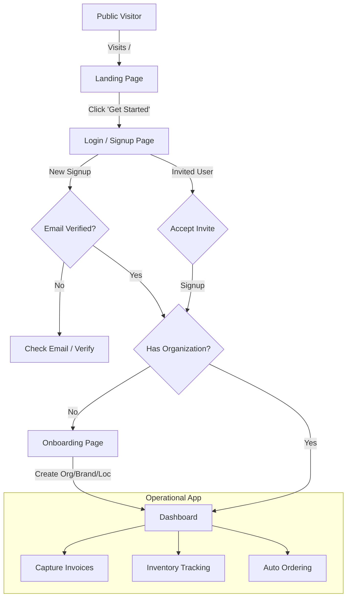

# MECURSOR SaaS Platform: System Workflow & Connection Map

This document outlines the end-to-end user journey, routing logic, and functional connections within the MECURSOR SaaS platform.

## 1. The User Journey
The following flowchart illustrates how a user moves from physical discovery to active management within the platform.

---

## 2. Authentication & Redirection Logic
The application routing in `App.jsx` follows a strict state-based decision tree to ensure security and valid configuration.

| User State | Condition | Target Path | Visible Component |
| :--- | :--- | :--- | :--- |
| **Anonymous** | Initial Visit | `/` | `LandingPage` |
| **Anonymous** | Explicit Login | `/login` | `LoginPage` |
| **Authenticated** | Missing `org_id` | `*` (Redirect) | `OnboardingPage` |
| **Authenticated** | Has `org_id` | `/` | `Dashboard` |
| **Platform Admin** | Is `platform_admin` | `/PlatformAdmin` | `PlatformAdmin` |

---

## 3. Sidebar & Feature Connections
The sidebar in `Layout.jsx` acts as the central command hub. Navigation visibility is restricted based on the user's role.

### Connection Hub
| Feature Area | Page Name | Role Access | Purpose |
| :--- | :--- | :--- | :--- |
| **Core** | `Dashboard` | Ground Staff+ | KPI overview, recent alerts, and quick actions. |
| **Admin** | `PlatformAdmin` | Platform Admin | System-wide management (Orgs, Users). |
| **Financials** | `Invoices` | Ground Staff+ | AI-extraction, status tracking, and history. |
| **Financials** | `Payments` | Manager+ | Vendor payments and reconciliation. |
| **Operations** | `Inventory` | Manager+ | Stock levels, location transfers, and waste logs. |
| **Operations** | `Auto Ordering` | Manager+ | Par-level based ordering and vendor sync. |
| **Operations** | `Products` | Manager+ | Catalog management and cost tracking. |
| **Operations** | `Recipes` | Manager+ | Recipe creation, dynamic costing, and margin analysis. |
| **Procurement** | `Vendors` | Manager+ | Vendor management and catalogs. |
| **Management** | `OrgManagement` | Owner | Organization settings and hierarchy. |
| **Management** | `UserManagement` | Owner | Team member invitations and role assignments. |
| **Security** | `AuditLogs` | Owner | Detailed history of system changes. |

---

## 4. Operational Cycles
The primary "Value Loop" of the platform consists of three interconnected stages:

1.  **Ingestion**: `Invoices` captures price data -> Updates `Products` costs.
2.  **Tracking**: `Inventory` tracks usage -> Triggers `Auto Ordering` suggestions.
3.  **Settlement**: `Payments` clears vendor balances -> updates `Invoices` status.

---

> [!TIP]
> **Navigation Tip**: Users can quickly switch between Locations and Brands using the context selectors (Dropdowns) in the top header, which instantly filters data across all operational pages.
