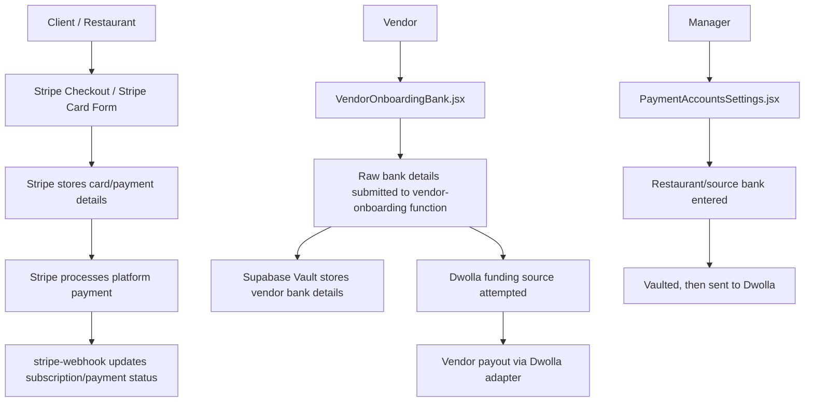
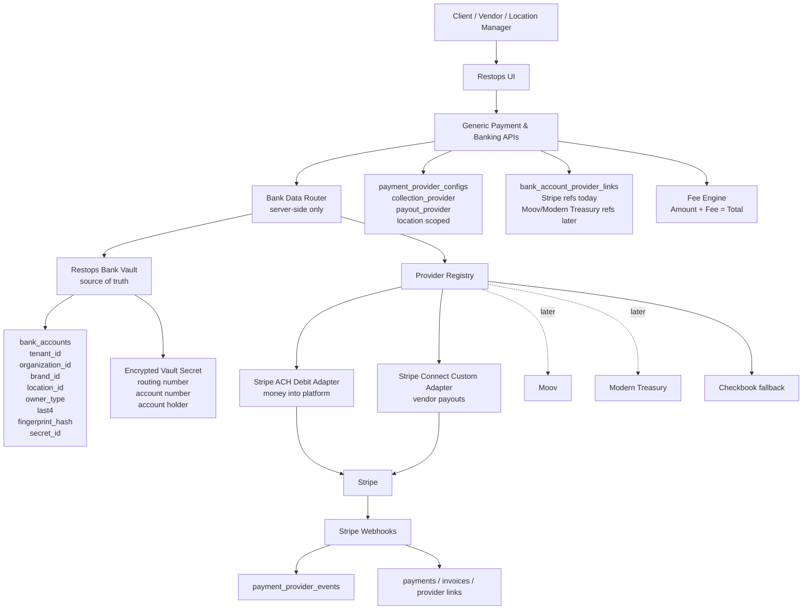
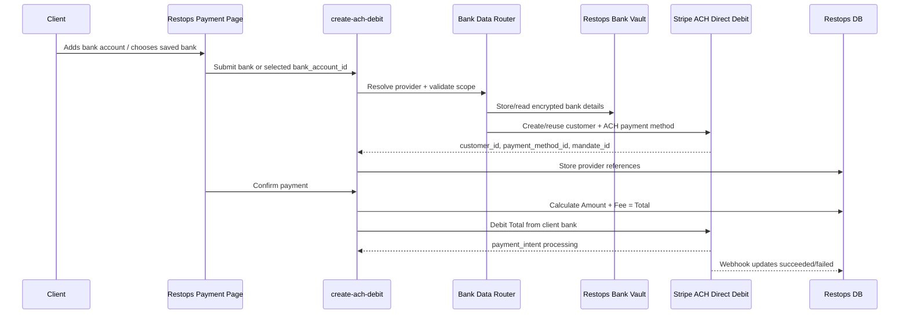
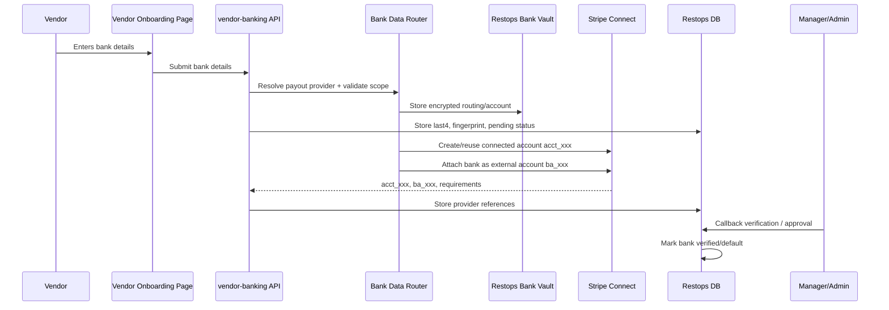
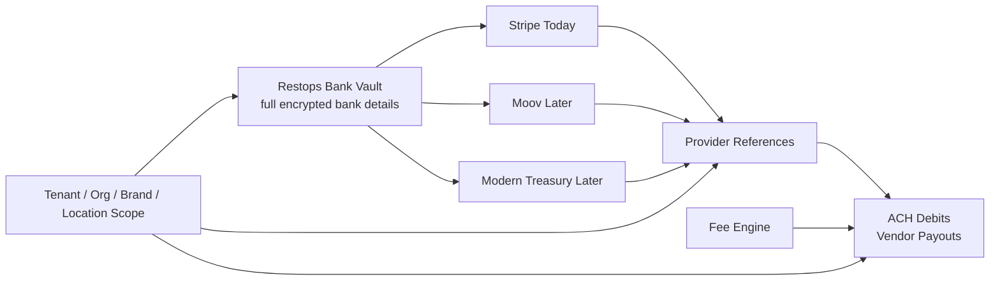
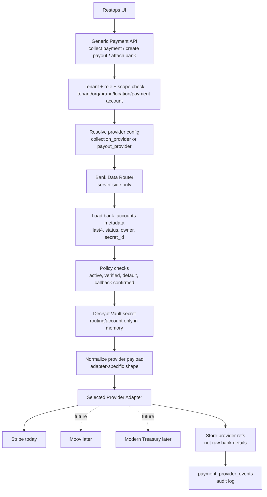
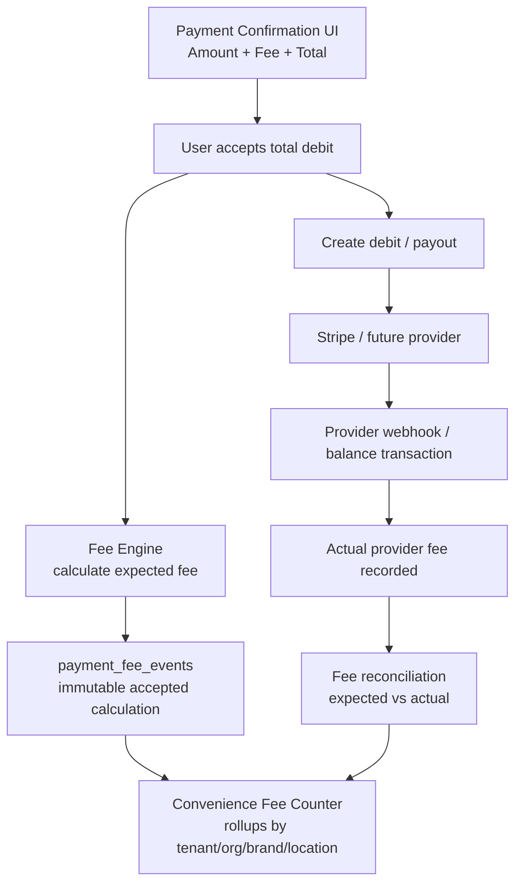

# Provider-Neutral ACH Payment Architecture Plan

## Goal

Build a provider-neutral ACH system where Restops stores bank details in its own encrypted vault, while Stripe, Moov, Modern Treasury, Checkbook, or another provider acts only as a replaceable processing adapter.

Core principle:

```text
Restops Bank Vault = source of truth for bank details
Payment providers = replaceable processors
```

This lets the platform use Stripe first while preserving the ability to switch ACH providers later without forcing clients or vendors to re-enter bank account numbers.

## Current Workflow



## Current Problem

The current architecture already has useful pieces, especially vaulting and a payout-provider dispatcher, but the implementation is still Dwolla-shaped.

Examples:

```text
create-dwolla-funding-source
dwolla_funding_source_url
dwolla_customer_url
dwolla_onboarding_status
dwolla_ach
```

Since Dwolla is no longer the target ACH provider, these should be replaced with provider-neutral concepts, not hardcoded Stripe-only replacements.

## Target Architecture



## Client ACH Collection Flow

This flow is for money coming into the platform from a client or restaurant bank account.



Payment page display:

```text
Amount:      $120.00
ACH Fee:       $0.55
Total Debit: $120.55
```

The total is deducted from the client bank account.

Store:

```text
base_amount = 120.00
fee_amount = 0.55
total_debit_amount = 120.55
fee_paid_by = client
```

## Vendor Banking Collection Flow

This flow is for collecting vendor bank details and linking them to the active payout provider.



Restops stores:

```text
encrypted bank details in Vault
last4 and status in bank_accounts
provider references in bank_account_provider_links
```

Stripe stores:

```text
connected account reference: acct_...
external bank account reference: ba_...
verification and payout status
```

Payouts use Stripe references after setup, not raw bank details on every payout.

## Stripe Connected Accounts Explained

For Stripe Connect Custom:

```text
Restops Stripe platform account = main platform account
Each vendor = one connected Stripe account under Restops
```

Examples:

```text
US Foods vendor -> Stripe connected account acct_usfoods
Sysco vendor -> Stripe connected account acct_sysco
Local bakery -> Stripe connected account acct_bakery
```

The vendor should not need to log in to Stripe if Restops builds the Custom onboarding and bank-management UI.

If vendor bank details change:

```text
Vendor submits new bank in Restops
Restops vault stores new bank details
Backend creates/replaces Stripe external account
New stripe_external_account_id is stored
Callback verification is required
New bank becomes default after approval
Old bank/provider link is archived
```

If client bank details change:

```text
Client submits new bank in Restops
Restops vault stores new bank details
Backend creates/replaces Stripe ACH payment method/mandate
Client accepts ACH authorization if required
New bank becomes default
Old bank/provider link is archived
```

## Data Model Plan

### bank_accounts

Provider-neutral bank account record. Full bank details are not stored as plain columns.

```text
id
tenant_id
organization_id
brand_id
location_id
owner_type: client | vendor | organization | location
owner_id
payment_account_id
account_holder_name
bank_name
account_type
routing_last4
account_last4
fingerprint_hash
verification_status
default_for_owner
is_active
secret_id
created_by_user_id
created_by_role
approved_by_user_id
approved_by_role
created_at
updated_at
deleted_at
```

Encrypted Vault secret:

```json
{
  "routing_number": "021000021",
  "account_number": "123456789",
  "account_holder_name": "ABC LLC",
  "account_type": "checking"
}
```

### fingerprint_hash

Generate the fingerprint in a backend-only trusted function:

```text
normalized_routing = digits only
normalized_account = digits only
fingerprint_hash = HMAC_SHA256(secret_pepper, tenant_id + normalized_routing + normalized_account)
```

Use HMAC instead of plain SHA256 so the hash cannot be easily brute-forced.

Purpose:

```text
detect duplicate bank accounts
avoid storing or comparing raw bank values in normal tables
support provider switching from the same vaulted bank account
```

### bank_account_provider_links

Provider-specific references attached to one vaulted bank account.

```text
id
tenant_id
organization_id
brand_id
location_id
bank_account_id
provider: stripe | moov | modern_treasury | checkbook
provider_use: collection | payout
provider_owner_ref
provider_bank_ref
provider_mandate_ref
provider_status
requirements_due
payouts_enabled
charges_enabled
metadata
last_synced_at
created_at
updated_at
```

Stripe vendor payout example:

```text
provider = stripe
provider_use = payout
provider_owner_ref = acct_123
provider_bank_ref = ba_123
```

Stripe client debit example:

```text
provider = stripe
provider_use = collection
provider_owner_ref = cus_123
provider_bank_ref = pm_123
provider_mandate_ref = mandate_123
```

### payment_provider_configs

Provider selection should be saved at the tenant/org/brand/location level, not asked from users every time.

```text
id
tenant_id
organization_id
brand_id
location_id
collection_provider = stripe_ach_debit
payout_provider = stripe_connect_custom
check_provider = checkbook
enabled
settings
created_at
updated_at
```

This allows location-level provider switching while keeping the UI stable.

### payment_fee_policies

Fee policy configuration.

```text
id
tenant_id
organization_id
brand_id
location_id
fee_paid_by: client | vendor | platform
collection_fee_mode: pass_through | absorbed | markup
payout_fee_mode: pass_through | absorbed | markup
disclosure_text
contract_version
enabled
created_at
updated_at
```

Default policy:

```text
fee_paid_by = client
collection_fee_mode = pass_through
payout_fee_mode = pass_through
```

### payment_fee_events

Immutable audit record for every displayed fee calculation.

```text
id
tenant_id
organization_id
brand_id
location_id
invoice_id
payment_id
base_amount
fee_amount
total_debit_amount
provider
fee_formula
fee_paid_by
displayed_to_user_at
accepted_by_user_at
contract_version
metadata
created_at
```

## Provider Registry

Only implement adapters for providers actually used now.

Initial adapters:

```text
stripeAchDebitCollection.ts
stripeConnectCustomPayout.ts
checkbookPayout.ts
```

Future adapters:

```text
moovAchCollection.ts
moovPayout.ts
modernTreasuryCollection.ts
modernTreasuryPayout.ts
```

Common concept:

```ts
interface PaymentProvider {
  createOwner()
  attachBankAccount()
  verifyBankAccount()
  createDebit()
  createPayout()
  syncStatus()
}
```

The app pages should call generic backend APIs, and the backend should select the active provider from `payment_provider_configs`.

## Provider Switching Flow



Switching providers:

```text
Admin changes active provider
System reads vaulted bank accounts
System creates provider references with new provider
Users/vendors may need to accept a new ACH authorization
Future payments use new provider
Old provider references stay for history/audit
```

Important distinction:

```text
Bank details = account/routing values stored in Restops Vault
Authorization/mandate = permission to debit or pay through a provider
```

Provider switching should not require retyping bank numbers, but may require a new authorization confirmation.

## Implementation Phases

### Phase 1: Replace Dwolla-Specific Data Model

Create provider-neutral tables:

```text
bank_accounts
bank_account_provider_links
payment_provider_configs
payment_fee_policies
payment_fee_events
payment_provider_events
```

Every relevant row must include:

```text
tenant_id
organization_id
brand_id
location_id
```

### Phase 2: Build Bank Vault Source Of Truth

Centralize bank storage in a provider-neutral vault API:

```text
store_bank_account_secret
get_bank_account_secret_for_provider
rotate_bank_account_secret
deactivate_bank_account
```

Do not allow normal users or admins to reveal full bank numbers.

### Phase 3: Add Stripe As First Provider

Add:

```text
stripeAchDebitCollection
stripeConnectCustomPayout
checkbookPayout
```

Set defaults:

```text
collection_provider = stripe_ach_debit
payout_provider = stripe_connect_custom
check_provider = checkbook
```

### Phase 4: Update Payment Pages

Update platform and invoice payment UI to show:

```text
Amount
Fee
Total
```

Apply to:

```text
client platform payments
client-to-vendor invoice payments
scheduled payments
batch payments
```

Default fee policy:

```text
client pays fee
```

### Phase 5: Update Onboarding Pages

Make onboarding provider-neutral:

```text
VendorOnboardingTax
VendorOnboardingBank
VendorOnboardingVerificationStatus
PaymentAccountsSettings
ClientBankAccountSettings
```

The main workflow should not say Dwolla. Provider details can appear in admin diagnostics/settings.

### Phase 6: Add Stripe Webhooks

Handle:

```text
payment_intent.processing
payment_intent.succeeded
payment_intent.payment_failed
charge.dispute.created
account.updated
payout.paid
payout.failed
external_account.updated
```

Webhook writes should update:

```text
payments
invoices
payment_provider_events
bank_account_provider_links
```

## Final Summary

The suitable architecture for Restops is:

```text
Restops-owned bank vault
provider-neutral payment configs
provider-neutral fee engine
Stripe as first active ACH provider
Checkbook as fallback
Moov/Modern Treasury-ready provider links
```

This keeps ACH core to the platform, lets Restops store banking details securely, supports Amount/Fee/Total debit flows, and preserves future provider switching without forcing clients or vendors to re-enter bank details.

## Bank Data Routing Revision

This revision answers the key operational question: if Restops stores the bank details, how are those details routed to Stripe, Moov, Modern Treasury, or another payment adapter?

The answer is a server-side Bank Data Routing Layer. The frontend never chooses a provider per transaction and never receives decrypted bank details. The backend resolves the active provider from saved configuration, validates tenant/location/payment scope, decrypts the bank secret only in memory, sends it to the selected adapter only when needed, and stores only provider references after setup.



### Routing Responsibilities

```text
1. Resolve which provider handles the action.
2. Verify the requested bank account belongs to the correct tenant/org/brand/location/payment account scope.
3. Verify the bank account is allowed for the action: active, verified, default if required, callback-confirmed for vendor payouts.
4. Decrypt the bank secret only inside a trusted backend function.
5. Pass raw routing/account details to the selected adapter only for provider setup or migration.
6. Store returned provider references and audit events.
```

Raw bank details must not be returned to the browser, written to ordinary logs, stored in payment history rows, sent to analytics, or exposed to normal admin screens.

### When Raw Bank Details Are Sent To An Adapter

Raw bank details are needed only for setup/migration actions, such as:

```text
attachBankAccount
createPaymentMethod
createExternalAccount
createCounterpartyAccount
migrateBankAccountToNewProvider
```

After that, actual payments should use references:

```text
Stripe client debit: customer/payment_method/mandate refs
Stripe vendor payout: connected account/external account refs
Moov later: account/bank/transfer refs
Modern Treasury later: counterparty/external account/payment order refs
```

### Internal Router-to-Adapter Payload

The Bank Data Router should pass a narrow typed payload to the adapter. Adapters should not query vault tables directly.

```ts
type ProviderBankPayload = {
  tenantId: string
  organizationId: string
  brandId?: string | null
  locationId?: string | null
  paymentAccountId?: string | null
  bankAccountId: string
  ownerType: 'client' | 'vendor' | 'organization' | 'location'
  ownerId: string
  accountHolderName: string
  accountType: 'checking' | 'savings'
  routingNumber: string
  accountNumber: string
  routingLast4: string
  accountLast4: string
}
```

The adapter returns provider references:

```ts
type ProviderLinkResult = {
  providerOwnerRef: string
  providerBankRef: string
  providerMandateRef?: string
  providerStatus: string
  requirementsDue?: Record<string, unknown>
  metadata?: Record<string, unknown>
}
```

Only `ProviderLinkResult` is stored in normal provider-link tables. Raw account/routing values remain in the vault.

### Revised Function Boundary

Add or refactor toward these generic backend functions:

```text
resolve_payment_provider_config
prepare_bank_payload_for_provider
attach_bank_to_active_provider
sync_bank_provider_link
create_provider_debit_from_bank_account
create_provider_payout_from_bank_account
migrate_bank_account_to_provider
```

The router is the only code path allowed to call:

```text
get_bank_account_secret_for_provider
```

### Example: Stripe Vendor Setup

```text
1. Vendor submits bank in Restops.
2. Restops stores full bank details in Vault.
3. Bank Data Router resolves payout_provider = stripe_connect_custom.
4. Router decrypts bank details in memory.
5. Router sends bank details to Stripe adapter.
6. Stripe adapter creates/updates connected account and external bank account.
7. Stripe returns acct_... and ba_...
8. Restops stores acct_... and ba_... in bank_account_provider_links.
9. Future payouts use acct_... / ba_..., not raw bank numbers.
```

### Example: Switching From Stripe To Moov Later

```text
1. Admin changes payout_provider from stripe_connect_custom to moov_ach.
2. Migration job finds active verified bank_accounts.
3. Router decrypts each bank secret in memory.
4. Router sends details to Moov adapter.
5. Moov returns new account/bank refs.
6. Restops stores Moov refs beside the old Stripe refs.
7. Future payouts use Moov refs.
8. Users do not retype bank numbers, but may need to accept a new ACH authorization if required.
```


## Convenience Fee Counter Revision

Add a platform-visible convenience fee counter so Restops can track how much payment-provider fee is being charged, recovered, absorbed, or deducted across client-to-platform and client-to-vendor payment flows.

### Fee Counter Goals

```text
1. Show Amount + Fee + Total before every debit.
2. Store the exact fee calculation accepted by the payer.
3. Track total convenience fees by tenant/org/brand/location.
4. Separate provider fees from platform markup.
5. Show whether the fee was paid by client, vendor, or platform.
6. Reconcile expected fees against actual Stripe/provider balance transaction fees.
```

### Payment-Level Display

Every debit/payment confirmation page should show:

```text
Amount:          $120.00
Convenience Fee:  $0.55
Total Debit:    $120.55
```

The total debit is what comes out of the payer bank account.

### Fee Counter Data Model

Extend `payment_fee_events` or add a rollup source table with these fields:

```text
id
tenant_id
organization_id
brand_id
location_id
invoice_id
payment_id
payer_type: client | vendor | platform
fee_paid_by: client | vendor | platform
provider
provider_fee_type: ach_debit | connect_payout | bank_validation | failed_payment | dispute | other
base_amount
provider_fee_amount
platform_markup_amount
total_fee_amount
total_debit_amount
fee_formula
fee_policy_id
contract_version
displayed_to_user_at
accepted_by_user_at
provider_balance_transaction_ref
provider_reported_fee_amount
reconciliation_status: expected | matched | mismatch | adjusted
created_at
```

For the current default policy:

```text
fee_paid_by = client
provider_fee_amount = Stripe calculated fee estimate
platform_markup_amount = 0 unless configured
total_fee_amount = provider_fee_amount + platform_markup_amount
total_debit_amount = base_amount + total_fee_amount
```

### Fee Counter Dashboard / Query

Add a dashboard counter grouped by tenant/org/brand/location/date range:

```text
Total base payments
Total convenience fees charged
Total provider fees estimated
Total provider fees actually paid
Total fees recovered from clients
Total fees deducted from vendors
Total fees absorbed by platform
Net fee gain/loss
Failed payment fees
Dispute fees
Bank validation fees
```

Example display:

```text
This Month
Base payments:             $48,250.00
Convenience fees charged:     $221.40
Provider fees paid:           $214.10
Fees recovered from clients:  $221.40
Platform absorbed:              $0.00
Net fee difference:             $7.30
```

### Fee Counter Architecture



### Reconciliation Rule

The fee shown to the payer is an accepted business fee. The actual provider fee may differ slightly because of provider rules, failures, disputes, validation fees, or settlement timing.

Track both:

```text
expected/displayed fee = what user accepted
actual provider fee = what Stripe/provider charged Restops
```

Then compute:

```text
net_fee_difference = total_fee_amount_collected - provider_reported_fee_amount
```

### Where It Appears In The Product

Add fee counters to:

```text
Payments > Setup / Provider Health
Payments > History filters and totals
Platform Admin > Billing / Payment Ops
Vendor payout detail page
Client payment receipt
Invoice payment confirmation modal
```

### Audit Requirement

For every fee collected, store proof that the payer saw and accepted it:

```text
displayed_to_user_at
accepted_by_user_at
accepted_by_user_id
contract_version
fee_formula
base_amount
fee_amount
total_debit_amount
```
