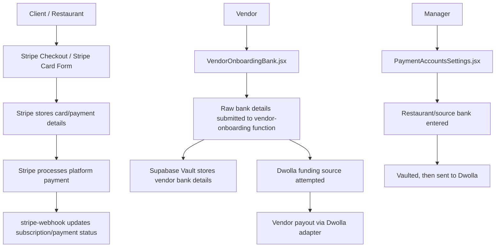
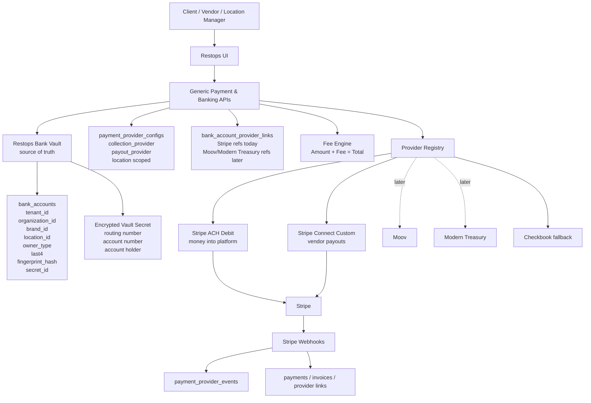
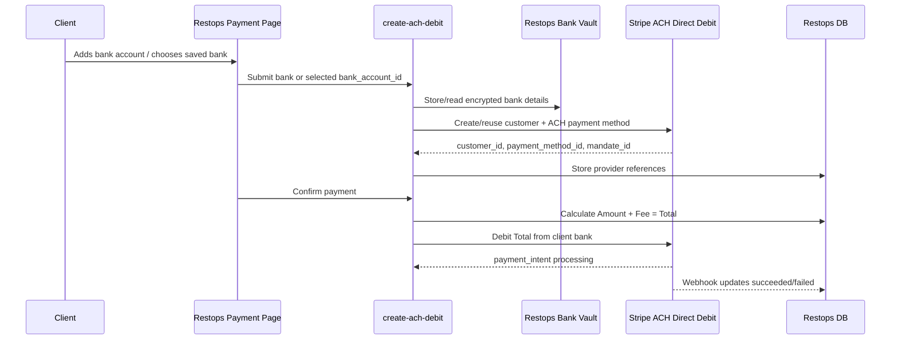
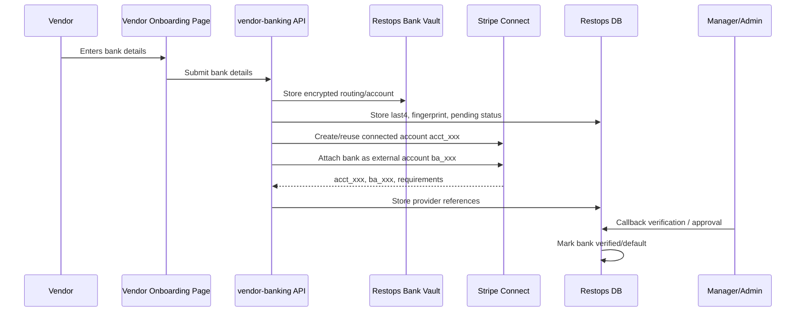
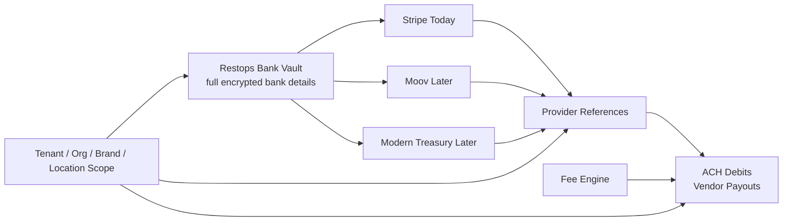

# Provider-Neutral ACH Payment Architecture Plan

## Goal

Build a provider-neutral ACH system where Restops stores bank details in its own encrypted vault, while Stripe, Moov, Modern Treasury, Checkbook, or another provider acts only as a replaceable processing adapter.

Core principle:

```text
Restops Bank Vault = source of truth for bank details
Payment providers = replaceable processors
```

This lets the platform use Stripe first while preserving the ability to switch ACH providers later without forcing clients or vendors to re-enter bank account numbers.

## Current Workflow



## Current Problem

The current architecture already has useful pieces, especially vaulting and a payout-provider dispatcher, but the implementation is still Dwolla-shaped.

Examples:

```text
create-dwolla-funding-source
dwolla_funding_source_url
dwolla_customer_url
dwolla_onboarding_status
dwolla_ach
```

Since Dwolla is no longer the target ACH provider, these should be replaced with provider-neutral concepts, not hardcoded Stripe-only replacements.

## Target Architecture



## Client ACH Collection Flow

This flow is for money coming into the platform from a client or restaurant bank account.



Payment page display:

```text
Amount:      $120.00
ACH Fee:       $0.55
Total Debit: $120.55
```

The total is deducted from the client bank account.

Store:

```text
base_amount = 120.00
fee_amount = 0.55
total_debit_amount = 120.55
fee_paid_by = client
```

## Vendor Banking Collection Flow

This flow is for collecting vendor bank details and linking them to the active payout provider.



Restops stores:

```text
encrypted bank details in Vault
last4 and status in bank_accounts
provider references in bank_account_provider_links
```

Stripe stores:

```text
connected account reference: acct_...
external bank account reference: ba_...
verification and payout status
```

Payouts use Stripe references after setup, not raw bank details on every payout.

## Stripe Connected Accounts Explained

For Stripe Connect Custom:

```text
Restops Stripe platform account = main platform account
Each vendor = one connected Stripe account under Restops
```

Examples:

```text
US Foods vendor -> Stripe connected account acct_usfoods
Sysco vendor -> Stripe connected account acct_sysco
Local bakery -> Stripe connected account acct_bakery
```

The vendor should not need to log in to Stripe if Restops builds the Custom onboarding and bank-management UI.

If vendor bank details change:

```text
Vendor submits new bank in Restops
Restops vault stores new bank details
Backend creates/replaces Stripe external account
New stripe_external_account_id is stored
Callback verification is required
New bank becomes default after approval
Old bank/provider link is archived
```

If client bank details change:

```text
Client submits new bank in Restops
Restops vault stores new bank details
Backend creates/replaces Stripe ACH payment method/mandate
Client accepts ACH authorization if required
New bank becomes default
Old bank/provider link is archived
```

## Data Model Plan

### bank_accounts

Provider-neutral bank account record. Full bank details are not stored as plain columns.

```text
id
tenant_id
organization_id
brand_id
location_id
owner_type: client | vendor | organization | location
owner_id
payment_account_id
account_holder_name
bank_name
account_type
routing_last4
account_last4
fingerprint_hash
verification_status
default_for_owner
is_active
secret_id
created_by_user_id
created_by_role
approved_by_user_id
approved_by_role
created_at
updated_at
deleted_at
```

Encrypted Vault secret:

```json
{
  "routing_number": "021000021",
  "account_number": "123456789",
  "account_holder_name": "ABC LLC",
  "account_type": "checking"
}
```

### fingerprint_hash

Generate the fingerprint in a backend-only trusted function:

```text
normalized_routing = digits only
normalized_account = digits only
fingerprint_hash = HMAC_SHA256(secret_pepper, tenant_id + normalized_routing + normalized_account)
```

Use HMAC instead of plain SHA256 so the hash cannot be easily brute-forced.

Purpose:

```text
detect duplicate bank accounts
avoid storing or comparing raw bank values in normal tables
support provider switching from the same vaulted bank account
```

### bank_account_provider_links

Provider-specific references attached to one vaulted bank account.

```text
id
tenant_id
organization_id
brand_id
location_id
bank_account_id
provider: stripe | moov | modern_treasury | checkbook
provider_use: collection | payout
provider_owner_ref
provider_bank_ref
provider_mandate_ref
provider_status
requirements_due
payouts_enabled
charges_enabled
metadata
last_synced_at
created_at
updated_at
```

Stripe vendor payout example:

```text
provider = stripe
provider_use = payout
provider_owner_ref = acct_123
provider_bank_ref = ba_123
```

Stripe client debit example:

```text
provider = stripe
provider_use = collection
provider_owner_ref = cus_123
provider_bank_ref = pm_123
provider_mandate_ref = mandate_123
```

### payment_provider_configs

Provider selection should be saved at the tenant/org/brand/location level, not asked from users every time.

```text
id
tenant_id
organization_id
brand_id
location_id
collection_provider = stripe_ach_debit
payout_provider = stripe_connect_custom
check_provider = checkbook
enabled
settings
created_at
updated_at
```

This allows location-level provider switching while keeping the UI stable.

### payment_fee_policies

Fee policy configuration.

```text
id
tenant_id
organization_id
brand_id
location_id
fee_paid_by: client | vendor | platform
collection_fee_mode: pass_through | absorbed | markup
payout_fee_mode: pass_through | absorbed | markup
disclosure_text
contract_version
enabled
created_at
updated_at
```

Default policy:

```text
fee_paid_by = client
collection_fee_mode = pass_through
payout_fee_mode = pass_through
```

### payment_fee_events

Immutable audit record for every displayed fee calculation.

```text
id
tenant_id
organization_id
brand_id
location_id
invoice_id
payment_id
base_amount
fee_amount
total_debit_amount
provider
fee_formula
fee_paid_by
displayed_to_user_at
accepted_by_user_at
contract_version
metadata
created_at
```

## Provider Registry

Only implement adapters for providers actually used now.

Initial adapters:

```text
stripeAchDebitCollection.ts
stripeConnectCustomPayout.ts
checkbookPayout.ts
```

Future adapters:

```text
moovAchCollection.ts
moovPayout.ts
modernTreasuryCollection.ts
modernTreasuryPayout.ts
```

Common concept:

```ts
interface PaymentProvider {
  createOwner()
  attachBankAccount()
  verifyBankAccount()
  createDebit()
  createPayout()
  syncStatus()
}
```

The app pages should call generic backend APIs, and the backend should select the active provider from `payment_provider_configs`.

## Provider Switching Flow



Switching providers:

```text
Admin changes active provider
System reads vaulted bank accounts
System creates provider references with new provider
Users/vendors may need to accept a new ACH authorization
Future payments use new provider
Old provider references stay for history/audit
```

Important distinction:

```text
Bank details = account/routing values stored in Restops Vault
Authorization/mandate = permission to debit or pay through a provider
```

Provider switching should not require retyping bank numbers, but may require a new authorization confirmation.

## Implementation Phases

### Phase 1: Replace Dwolla-Specific Data Model

Create provider-neutral tables:

```text
bank_accounts
bank_account_provider_links
payment_provider_configs
payment_fee_policies
payment_fee_events
payment_provider_events
```

Every relevant row must include:

```text
tenant_id
organization_id
brand_id
location_id
```

### Phase 2: Build Bank Vault Source Of Truth

Centralize bank storage in a provider-neutral vault API:

```text
store_bank_account_secret
get_bank_account_secret_for_provider
rotate_bank_account_secret
deactivate_bank_account
```

Do not allow normal users or admins to reveal full bank numbers.

### Phase 3: Add Stripe As First Provider

Add:

```text
stripeAchDebitCollection
stripeConnectCustomPayout
checkbookPayout
```

Set defaults:

```text
collection_provider = stripe_ach_debit
payout_provider = stripe_connect_custom
check_provider = checkbook
```

### Phase 4: Update Payment Pages

Update platform and invoice payment UI to show:

```text
Amount
Fee
Total
```

Apply to:

```text
client platform payments
client-to-vendor invoice payments
scheduled payments
batch payments
```

Default fee policy:

```text
client pays fee
```

### Phase 5: Update Onboarding Pages

Make onboarding provider-neutral:

```text
VendorOnboardingTax
VendorOnboardingBank
VendorOnboardingVerificationStatus
PaymentAccountsSettings
ClientBankAccountSettings
```

The main workflow should not say Dwolla. Provider details can appear in admin diagnostics/settings.

### Phase 6: Add Stripe Webhooks

Handle:

```text
payment_intent.processing
payment_intent.succeeded
payment_intent.payment_failed
charge.dispute.created
account.updated
payout.paid
payout.failed
external_account.updated
```

Webhook writes should update:

```text
payments
invoices
payment_provider_events
bank_account_provider_links
```

## Final Summary

The suitable architecture for Restops is:

```text
Restops-owned bank vault
provider-neutral payment configs
provider-neutral fee engine
Stripe as first active ACH provider
Checkbook as fallback
Moov/Modern Treasury-ready provider links
```

This keeps ACH core to the platform, lets Restops store banking details securely, supports Amount/Fee/Total debit flows, and preserves future provider switching without forcing clients or vendors to re-enter bank details.
