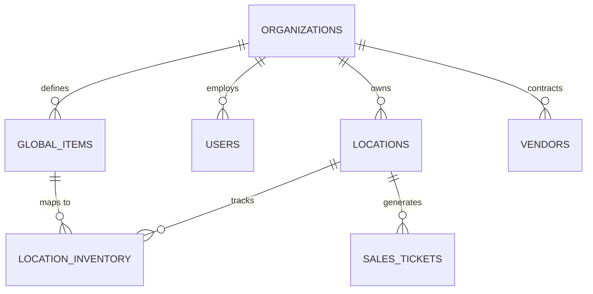
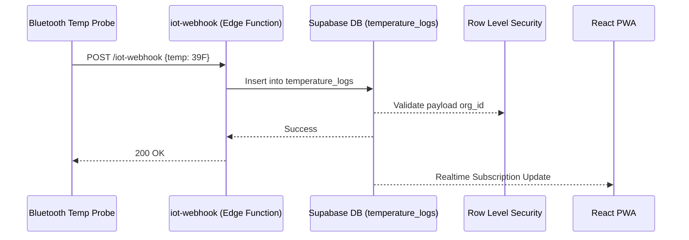
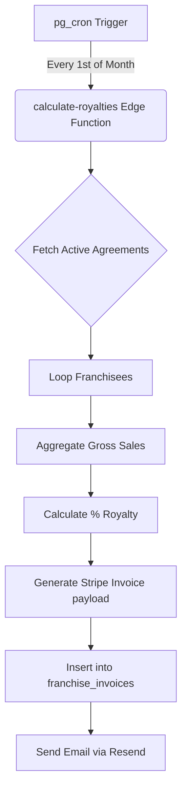
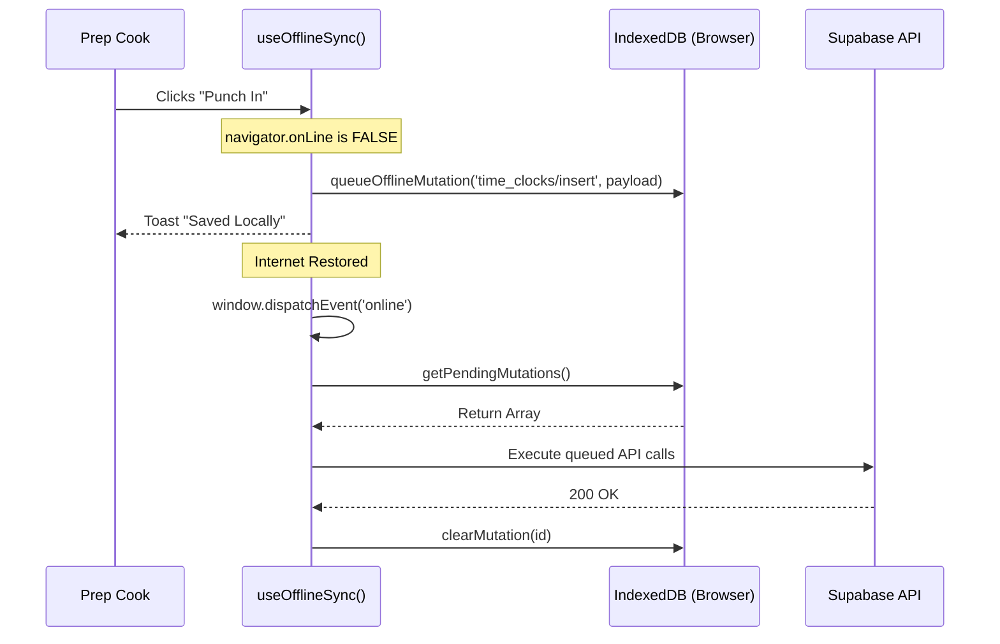
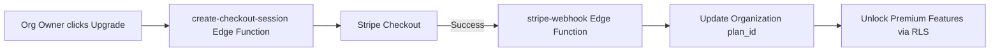

# Restops360 System Architecture & Topology

This document provides high-level architectural flows for the Restops360 ecosystem using Mermaid.js.

## 1. High-Level Entity Relationship Diagram (ERD)
This diagram illustrates the core multi-tenant structure mapping Organizations to Locations, and the isolation of Inventory and Sales.

## 2. IoT Webhook Flow (Temperature Probes)
How physical hardware communicates with the Restops360 cloud via Edge Functions.

## 3. Automated Franchise Royalty Engine
How the cron-triggered Edge Function calculates billing periods and issues invoices.

## 4. Deep Offline Sync (PWA Resilience)
How the kitchen tablet survives network outages.

## 5. Billing & Subscription Lifecycle
Handling SaaS monetization securely.

